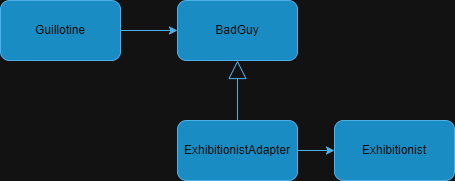

== The Adapter Pattern
Given some client class, designed to work with a worker class over a specific interface (Schnittstelle :-)). The _Adapter Pattern_ helps, to use a worker class with a different interface, without changing the client class at all.    

.Exhibitionists today, my Majesty.
<<<<<<< HEAD

=== How it works
.UML diagram for the above situation.

=======
image::/assets/images/EureHoheit_s.png[Ref,400]
=== How it works
.UML diagram for the above situation.
image::/assets/images/diagram.png[diagram,400]
>>>>>>> 3a7533a4caf6328f2d20060ae29378d3a9253312

The implementation using java is as follows

==== Guillotine.java
[source,java]
----
public class Guillotine {
    public void execute(BadGuy bg){
        bg.removeHead();
    }
}
----

==== BadGuy.java

[source,java]
----
public class BadGuy {
    public BadGuy(){
        head = new Head();
    }
    public void removeHead(){
        head = null;
    }

    public boolean hasHead(){
        return head != null;
    }
    private Head head;
    static class Head {};
}
----

==== ExhibitionistAdapter.java

[source,java]
----
public class ExhibitionistAdapter  extends BadGuy{

    public void install(Exhibitionist ex){
        this.ex = ex;
    }
    @Override
    public void removeHead() {
        ex.removeZipfel();
    }

    private Exhibitionist ex;
}
----

==== Exhibitionist.java

[source,java]
----
public class Exhibitionist {

    public Exhibitionist(){
        zipfel = new Zipfel();
    }

    public void removeZipfel(){
        zipfel = null;
    }

    public boolean hasZipfel(){
        return zipfel != null;
    }

    static class Zipfel{};

    private Zipfel zipfel;
}
----

=== Testing
==== GuillotineTest.java
[source,java]
----
import org.junit.jupiter.api.Test;
import static org.junit.jupiter.api.Assertions.*;

class GuillotineTest {

    @Test
    void execute_BadGuy() {
        Guillotine g = new Guillotine();
        BadGuy guilty = new BadGuy();

        assertTrue(guilty.hasHead());
        g.execute(guilty);
        assertFalse(guilty.hasHead());
    }

    @Test
    void execute_Exhibitionist(){
        Guillotine g = new Guillotine();
        ExhibitionistAdapter adaptedLarry = new ExhibitionistAdapter();
        Exhibitionist larry = new Exhibitionist();
        adaptedLarry.install(larry);

        assertTrue(larry.hasZipfel());
        g.execute(adaptedLarry);
        assertFalse(larry.hasZipfel());
    }
}
----

=== Run it
==== Main.java
[source,java]
----
public class Main {
    public static void main(String[] args){
        System.out.println("--------------------------------- ");
        System.out.println("|   Executions in town today!   |");
        System.out.println("|        Free admission.        |");
        System.out.println("--------------------------------- ");
        Exhibitionist larry = new Exhibitionist();
        ExhibitionistAdapter adapter = new ExhibitionistAdapter();
        adapter.install(larry);

        Guillotine g = new Guillotine();
        System.out.println("Has Larry Zipfel? " + larry.hasZipfel());
        System.out.println("Execute...zzingh.");
        g.execute(adapter);
        System.out.println("Has Larry Zipfel? " + larry.hasZipfel());
    }

}
----
==== Output
[source,bash]
----
--------------------------------- 
|   Executions in town today!   |
|        Free admission.        |
--------------------------------- 
Has Larry Zipfel? true
Execute...zzingh.
Has Larry Zipfel? false

Process finished with exit code 0
----

