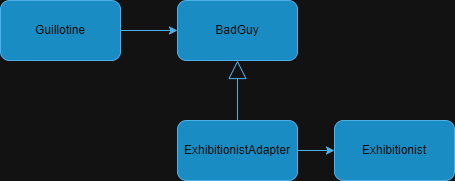

== The Adapter Pattern
Given some client class, designed to work with a worker class over a specific interface (Schnittstelle :-)). The _Adapter Pattern_ helps, to use a worker class with a different interface, without changing the client class at all.    

.Exhibitionists today, my Majesty.
image::_posts/EureHoheit.png[Ref,400]
=== How it works
.UML diagram for the above situation.

=== Sample java code 

[source,java]
puts "Hello, World!"

