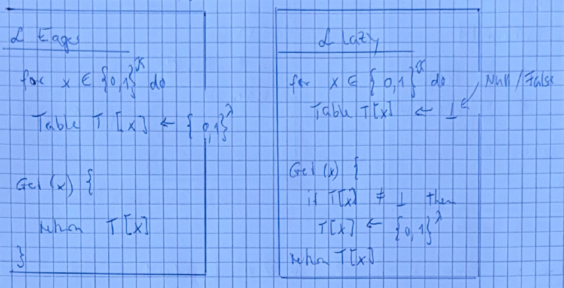
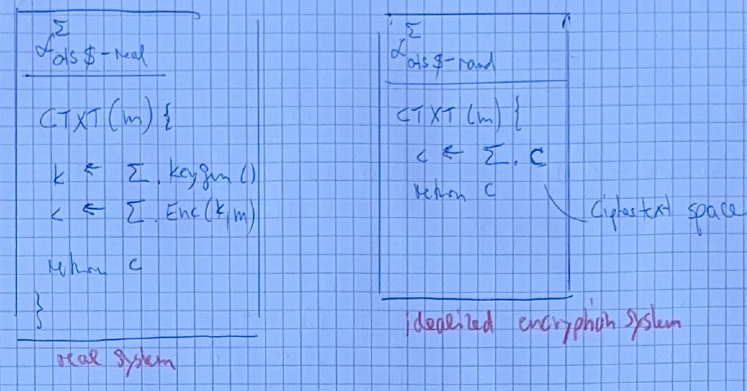
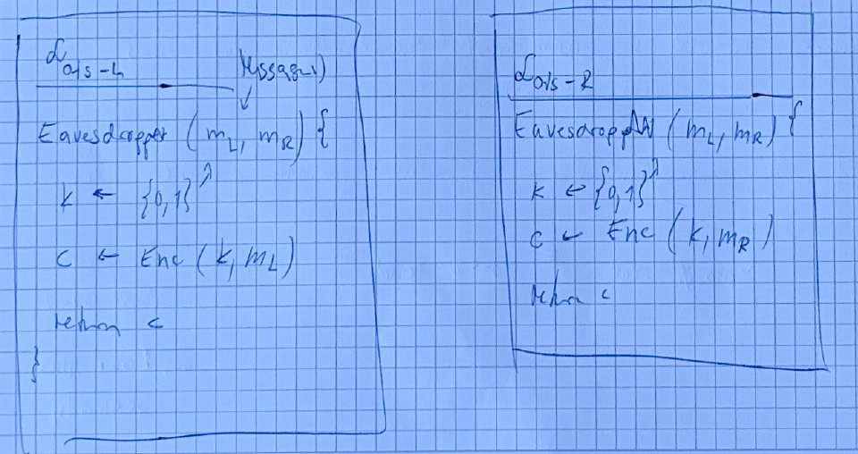

== Kerkhoff's principle

====
No security by obscurity.
====

Security shall depend on the key only, we have many of them, but if the algorithm is secret and an attacker finds it, we have to develop a new algorithm. 

== Provable security
Remember the one-time pad. It's provably securein a probabilistic model. Can we have the same security but with shorter key than the message? Remember Entropy and so on. Thus the key needs the same length as the message or the same entropy.

=== Information-theoretic security
We permit that an adversary performs arbitrary computations, infinitely fast. 

This model is to strong.

=== Computational security
Computation cannot be infinitely fast. 

=== Formalizing symmetric-key encryption
We have the following syntax:

*Def* A symmetric symm-key encr schene $\Sigma$ has 3 algorithms.

1. $KeyGen() \rightarrow k$ , randomized algorithm
2. $Enc(k,m) \rightarrow c$, randomized
3. $Dec(k,c) \rightarrow m$, deterministic

*Notation* $\Sigma = (\Sigma .KeyGen, \Sigma .Enc, \Sigma .Dec)$

* Key space $K$
* Message space $M$
* Cipher space $C$

=== Correctness
*Def* An encryption scheme $\Sigma$ is correct if

$\forall k \in K, \forall m \in M$ it holds

$\Sigma.Dec(k,Enc(k,m))=m$

[Note] 
----
We want the scheme to be correct for all messages. For the one-time pad, we showed this. Correctnes is also given for the identity function.
----

=== Security
Much more difficult than correctnes. We can send just a random string, this is then not correct. 

*Security against an adversary A*

* What does A learn? -> c
* in OTP how is c produced? 
  - $k \leftarrow \lbrace 0,1 \rbrace ^{\lambda}$
  - $c \leftarrow m \oplus k$

Want to generalize this syntay, such for signatures, pseudorandom functions)

== Assumptions
* A performs probabilistic computations $\iff$
* A is a randomized algorithm $\iff$
* A implemented by Turing Machine. (_Turning Machine to randomize modeled as a second input stream which is random_)

and A outputs a Bit $b \in \lbrace 0,1 \rbrace$

The formalization goes as follows: 
[Note]
----
The Adversory lifes in two worlds, on seeing the cipher text c and in the other seeing only a random bit string. Then if we can show, that the Adversory cannot tell in which world he lifes, we are secure. 
----
=== Real world
A optains c produced by the encryption scheme $\Sigma$ from some Message m.

=== Ideal (fake) world
A optains a random element of the cipher space, produced without m.

=== Formalizing , the definition
Call a scheme secure, when for any adversary $A$ :

$\mathcal{P}[\text{A is in real world} \rightarrow 1] = \mathcal{P}[\mbox{A is in ideal world} \rightarrow 1]$

Means the probability that $A$ outputs 1 in the ideal world is equal that $A$ outputs 1 in the ideal world, same as:

* ... no Adversary can distinguish.
* ... A has no information about plain text.

[NOTE]
====
We have here three sources of randomness: the key we choose is random, the Adversary choose random bits and maybe the algorithm chooses random bits.
====

==== Defining seturity notions using libraries
Notion form [R21], in other books this libraries are called experiments. This is just a tool to define security. The analogy to static and dynamic linking of a program helps.

*Def* a library $L$ is a collection of functions or subrutines and private or static data. The interface of $L$ consists only of its functions with their arguments and types.

*Def* Running a programm $P$ with librarary $L$ is written as $P \diamond L$ , meaning $P$ linked to $L$.

To say that the program $P$ linked to $L$ outputs $x$ we write:

$P \diamond L \rightarrow x$

===== Example
Given a Library 

'''
$L$

'''
$s \leftarrow \lbrace 0,1 \rbrace ^{\lambda}$ +
`Reset()` +
$s \leftarrow \lbrace 0,1 \rbrace ^{\lambda}$ +
`Guess(x)` +
return $x =^? s$ 

'''
* as with classes, the calling program cannot access $s$
* the calling programm has no further information on s, except what is returned by `Guess(x)`

Now lets write a Program A

* $c \leftarrow \lbrace 0,1 \rbrace ^{\lambda}$
* return Guess(x)

Then 

$P[A \diamond L \rightarrow TRUE] = 2^{- \lambda}$

Let's consider a second program B

* $c \leftarrow 1 ^{\lambda}$
* return Guess(x)

Then again

$P[B \diamond L \rightarrow TRUE] = 2^{- \lambda}$

What's the running time? Constant, only one function call. 

Program C, to find s from the library

* repeat
* $x \leftarrow \lbrace 0,1 \rbrace ^{\lambda}$
* until Guess(x) (=True)
* return x

Then 

$P[C \diamond L \rightarrow s ] = 1$

the expected running time here is $\mathcal{O}(2^{\lambda})$

Note that program C is a Las Vegas algorithm, maybe not terminating at all. 

===== Tow libraries with equal input-output behaviour

*Def* Two libraries $L_1$ and $L_2$ are called interchangable (or exchangable) written $L_1 \equiv L_2$  if they have the same interface and if for all programs A

$P[A \diamond L_1 \rightarrow 1] = P[A \diamond L_2 \rightarrow 1]$

From observing, we can not figure out, which Library is in use. Processing time here not considered. 

===== Example for interchanchable
* Unreachable code
* different implementation of the same algorithme 
* diferred choices

Eager vs lazy sampling

$\implies L_{eager} \equiv L_{lazy}$

The different time behaviour is irrelevant here.

The Adversary $A$ is often called a _distinguisher_.

==== Defining encryption security with libraries

Interchangable libraries $\iff$ arbitrary powerfull Adversary $A$

[NOTE]
====
The OTP is indistinguishable from a random generator, thus two equal libraries.
====

*Def* An encryption scheme $\Sigma$ has uniform cipher text if 

$L_{ots$-real} \equiv L_{ots$-random}$

_Here $ comes from flipping a coin, and ots=one time security._

===== Example

$Enc(k,m) \rightarrow (m \oplus k) || 0101$

This scheme hat ots but not uniform distribution. Here 
$L^{\Sigma}_{ots$-real} \not\equiv L^{\Sigma}_{ots$-real}$

This notion is good, but too strong! We need an update.

*Def* An encryption scheme $\Sigma$ has one-time security if 

$L_{ots$-left} \equiv L_{ots$-right}$

 

This represents best case for $A$ $\iff$ This is worst case for $\Sigma = (keyGen, Enc, Dec)$

[cols="1,1"]
|===
|Cell in column 1, row 1
|Cell in column 2, row 1

|Cell in column 1, row 2
|Cell in column 2, row 2

| $\Sigma = (keyGen, Enc, Dec)$
|Cell in column 2, row 3
|===