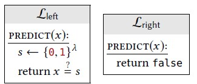

## Recap
Explain negligible probability. 

This is an asymptotic behaviour, parametrized by $\lambda$. $\lim_{\lambda\to\infty} f(\lambda) = 0$ does not imply negligiblity. Remember the definition in other words:
> $f(\lambda) \ \text{is negligible} \iff \forall \ c \ \exists \ \lambda_0 : \ \forall \ \lambda \ge \lambda_0 \ f(\lambda) < \frac{1}{\lambda^c}$

# Indistinguishability
Our previous security definition for *interchangeability* requires the two libraries have exactly the same effect. We want weaken this, because it is sufficent, if the two libraries have negligible difference, if ppt programms are using them. 

> **Def**
> Let $L_l$ and $L_r$ be two libraries with a common interface. We say they are indistinguishable and write $L_l \cong L_r$, if for all ppt $A$ that output 1 bit
> 
> $$P[A \diamond L_l \implies 1] \cong P[A \diamond L_r \implies 1]$$
> 
> The absolute difference of the two probabilities we call *advantage* or *bias* and is a function of $\lambda$.

**Remark** The operator $\cong$ is only transitive, if applied a polynomial number of time. Because closure of polynom multiplication. 

### Example
Take the two libraries

One strategy of an $A_q$ could be to try $q$ times. Rather than calculating the exavt probabilita, we use union bound to give an upper bound:

$$P[A_q \diamond L_l \implies 1] \le P[1^{st} \ \text{returns true}] + P[2^{nd} \ \text{returns true}] + \ldots = q\cdot 2^{-\lambda}$$

Thus $A_q$ has negligible probability to distinguish the two libreries. But we have to show this for all ppt $A$. this leads us to the following 
## Bad-Event Lemma

