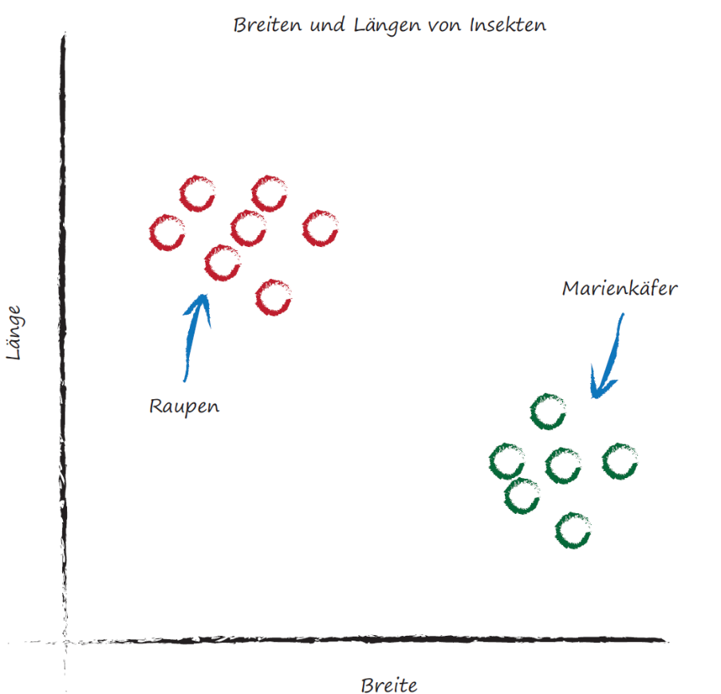
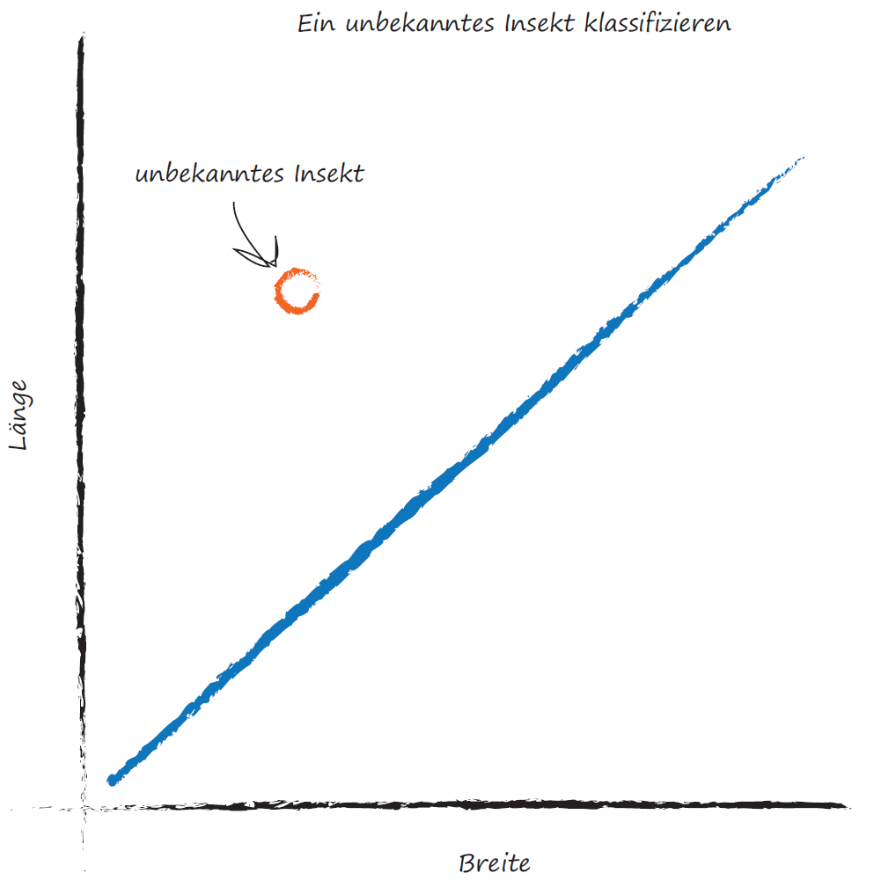
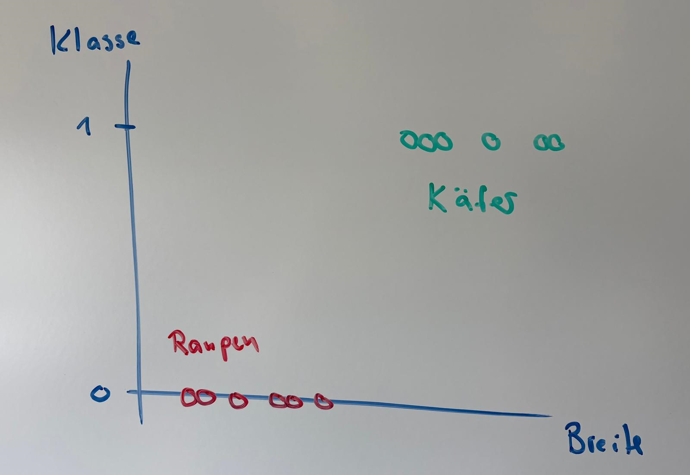
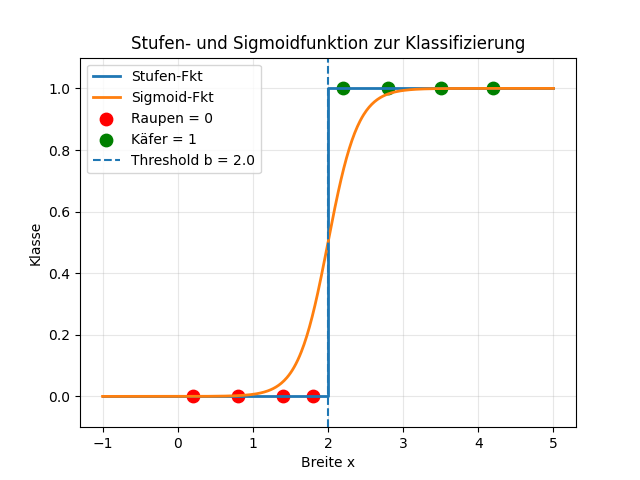

# Klassifikation
Beispiele und Bilder aus dem Buch *Neuronale Netze, Tariq R. O'REILLY*.

Hast du dich schon mal gewundert, wie eine Email als Spam markiert wird? 

Das ist eine typische Aufgabe des maschinellen Lernens zur Klassifizierung von Emails in $\{\text{spam}, \text{nicht-spam}\}$. 

Nach einer Einführung werden wir einen Spamfilter kennen lernen. 

## Klassifizierung durch Distanzen

Hier haben wir zwei Klassen, nämlich {Raupen, Käfer} und die Features {Länge, Breite}.
Die Lineare Regression ist hier nicht nützlich. 



Vielmehr suchen wir eine Trennlinie, welche es uns erlaubt, ein unbekanntes Insekt zu klassifizieren. Die Trennlinie wird dabei anhand der Trainingsdaten gelernt. 




> #### Frage
> Warum kann eine optimale Trennlinie im Allgemeinen nicht als $f(x)=ax+b$ modelliert werden?

>#### Übung
>
>Benutze *python* und  *matplotlib* um die zwei folgenden Datenpunkte in einem Diagramm zu visualisieren. 
>
>| Trainingsdaten | B(Breite) | L (Länge) | BxL | Punktfarbe
>|---|---:|---:|---|---|
>| Marienkäfer | 3.0 | 1.0 | 3.0 × 1.0 |grün|
>| Raupe | 1.0 | 3.0 | 1.0 × 3.0 |rot|
>
>Zeichne eine beliebige Gerade ein, in blau, welche die beiden Punkte separiert. 
>Beschrifte die Achsen und füge eine Legende sowie einen Titel hinzu.

## Mit Wahrscheinlichkeit

Haben wir nur ein Feature und eine Klassifizierung Raupen=0 und Käfer=1, können wir das wie folgt visialisieren. 



Hierbei stellen wir uns die Frage, wie wahrscheinlich es ist, dass ein Datenpunkt zur Klasse $1$ gehört. 

Dazu benötigen wir eine geeignete Aktivierungsfunktion, welche für eine reelle Eingabe, hier die Breite des Insekts, Werte im Intervall $[0,1]$ liefert.

Die Sprungfunktion $f:\mathbb{R} \rightarrow \{0,1\}$ welche ab einer bestimmten Breite $b_R$ von $0$ auf $1$ springt

$$f(x) = \begin{cases}
0 & ,x \le b_R \\
1 &  ,sonst 
\end{cases}$$

kann zur Klassifizierung gelernt werden. Geeigneter ist herfür die *Sigmoidfunktion*, welche kontinuierlich ändert und beobachtetes verhalten realistischer abbildet. Die Sigmoidfunktion, welche auch als *logistische Funktion* bezeichnet wird, ist wie folgt definiert:

$$
y(x) = \frac{1}{1+e^{-x}}
$$



Haben wir mehrere Features $x_i$ bestimmen wir $x$ in der Sigmoidfunkton mit den Gewichten $\theta_{i}$ wie folgt:

$$
h(x) = x_0 + \theta_1 x_1 + \ldots \theta_k x_k
$$

In Vektorschreibweise und mit $x_0=1$ ist das dasselbe wie

$$
h(x) = \theta^T x  \; \; \; \text{mit}\: x,\theta \in \mathbb{R}^k
$$

Die Gewichte $\theta$ sind die unbekannten Parameter unseres Modells

$$
y(x) = \frac{1}{1+e^{-h(x)}}
$$

welches angibt, mit welcher Wahrscheinlichkeit ein Datansatz $x$ zu der Klasse $0$ oder $1$ gehört. 

*Tipp: auf [geogebra.org](https://www.geogebra.org/classic?lang=de) kann das einfach visualisiert werden, mit den Parametern $\theta_1$, $\theta_0$ als Schieberegler.*

Die Gewichte werdem mit Gradient Descent bestimmt. Siehe Thema **Logistische Regerssion**. Im nächsten Kapitel lernen wir einen Spamfilter kennen, welcher mit einem naiven Ansatz und etwas Wahrscheinlichkeitstheorie gute Resultate liefert. Siehe **Naive Bayes Classifier**.
 

### Python Code für Sigmoidfunktion
```python
import numpy as np
import matplotlib.pyplot as plt

# Threshold
b = 2.0

# X range for plotting functions
x = np.linspace(-1, 5, 500)

# Step function: 0 if x < b, else 1
step = np.where(x < b, 0, 1)

# Sigmoid function centered at b
k = 5  # steepness of sigmoid
sigmoid = 1 / (1 + np.exp(-k * (x - b)))

# Example class 0 and class 1 points
x_class0 = [0.2, 0.8, 1.4, 1.8]
y_class0 = [0] * len(x_class0)

x_class1 = [2.2, 2.8, 3.5, 4.2]
y_class1 = [1] * len(x_class1)

# Plot step function
plt.step(x, step, where='post', label='Stufen-Fkt', linewidth=2)

# Plot sigmoid
plt.plot(x, sigmoid, label='Sigmoid-Fkt', linewidth=2)

# Plot points
plt.scatter(x_class0, y_class0, color='red', s=80, label='Raupen = 0')
plt.scatter(x_class1, y_class1, color='green', s=80, label='Käfer = 1')

# Threshold line
plt.axvline(b, linestyle='--', label=f'Threshold b = {b}')

# Labels and title
plt.xlabel("Breite x")
plt.ylabel("Klasse")
plt.title("Stufen- und Sigmoidfunktion zur Klassifizierung")

# Limits and grid
plt.ylim(-0.1, 1.1)
plt.grid(True, alpha=0.3)

# Legend
plt.legend()

# Show plot
plt.show()
``` 

## Lösungen
Lösung zur Übung
```python
import matplotlib.pyplot as plt

# Data points
x = [1, 3]
y = [3, 1]

# Plot each point separately so they can appear in the legend
plt.scatter(1, 3, color="red", label="Raupe")
plt.scatter(3, 1, color="green", label="Marienkäfer")

# Labels and title
plt.xlabel("X")
plt.ylabel("Y")
plt.title("Scatter Plot of Two Points")

# Add legend
plt.legend()

# Show plot
plt.show()
```
Antwort zur Frage: Eine Trennlinie kann auch senkrecht sein, das wäre aber eine lineare Funktion mit Steigung $\infty$. 

