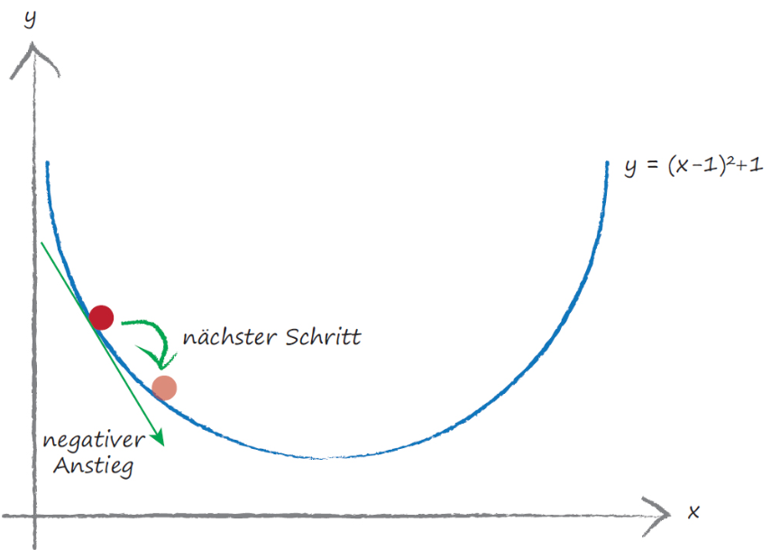
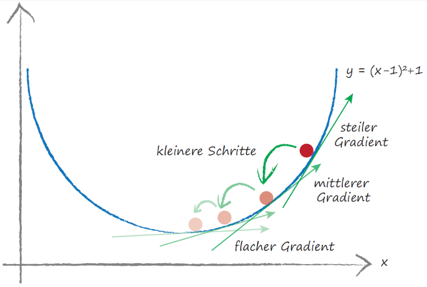
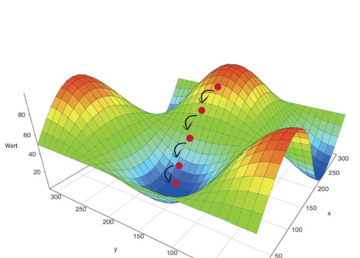
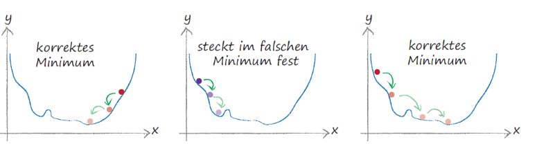

# Wie werden die Gewichte aktualisiert
Eine Zusammenfassung aus dem Buch *Neuronale Netze, Tariq R. O'REILLY*. 

Ein Modell trainieren heisst, die unbekannten Parameter, welche auch Gewichte genannt werden, zu bestimmen. Bei der linearen Regression mit dem LMS-Algorithmus (Least Mean Squares) in 2D sind die Gewichte oder Modellparameter die Steigung $m$ und der y-Achsenabschnitt $b$ der Geraden $f(x)= mx + b$ , welche wir suchen. 

Wir könnten alle Gewichte ausprobieren, bis wir eine gute Kombination gefunden haben. Diese Idee kann sogar nützlich sein, bei schwierigen Problemen, indem wir zufällig Kombinationen austesten. Dieses Vorgehen heisst *Brute Force Methode* und ist in der Praxis nicht anwendbar, weil zu viele Kombinationen existieren. Das Problem wurde erst in den 60/70'er Jahren gelöst und führte zu einem Boom von Methoden, mit welchen eindrucksvolle Aufgaben gelöst werden konnten. 

Das Vorgehen entspricht dem Abstieg ins Tal in einer bergigen Landschaft, welche wir nicht kennen und nur in unserer unmittelbaren Nähe erkunden können. Wir suchen die Richtung des grössten Abstiegs, gehen eine kurze Strecke in diese Richtung und beginnen erneut. Dies wiederholen wir so oft, bis wir den tiefsten Punkt gefunden haben. 

Betrachten wir ein einfaches Beispiel anhand der Funktion $y=(x-1)^2+1$. Den Fehler $y$ wollen wir minimieren und wir suchen das $x$ dazu. Der Ausgangspunkt ist zufällig und wir schauen, in welche Richtung $y$ kleiner wird, und gehen ein kleines Stück in diese Richtung. 



Der Gradient zeigt die Richtung des stärksten Anstiegs.
Für die Minimierung gehen wir deshalb in die entgegengesetzte Richtung. Die Schrittgrösse, wird zusätzlich durch die Lernrate skaliert.



Bei zwei Parametern veranschaulicht die folgende Darstellung das Gradientenverfahren. 



Da wir uns nur lokal orientieren können, ist es nicht ausgeschlossen, dass wir ein lokales Minimum finden. Oder bei zu grossen Schritten finden wir das Minimum gar nicht.



Mit dem Gradientenverfahren wollen wir anhand von vielen Trainingsdaten den Fehler unseres Modells minimieren. D.h. wir suchen das Minimum der sogenannten *Loss Function* oder Fehlerfunktion. Der Fehler ist dabei die Summe aller Abweichungen der Soll- zu den  Ist-Werten. Es gibt drei Möglichkeiten, einen Fehler zu bestimmen. Bei der Differenz $soll-ist$ kann sich der Fehler aufheben. Der Absolutbetrag $|soll-ist|$ ist beim Minimum nicht differenzierbar und das Gradientenverfahren findet das Minimum nicht, weil die Schrittweite nicht angepasst werden kann. Daher wird $(soll-ist)^2$ verwendet. 

| soll | ist | $soll-ist$ | $\|soll-ist\|$ | $(soll-ist)^2$
|---|---|---|---|---|
| 0.4 | 0.5 | -0.1 | 0.1 |0.01|
| 0.8 | 0.7 | 0.1 | 0.1 |0.01|
| 1.0 | 1.0 | 0 | 0 |0|
| Summe |  | 0.0 | 0.2 |0.04|

> #### Übung
> Zeichne die Betragsfunktion $|x-2|$ auf Papier. 
> Benutze dann  *python* und  *matplotlib* um die drei Funktionen $x-2$, $|x-2|$ und $(x-2)^2$ in einem Diagramm zu visualisieren. 

# Von der Intuition zur mathematischen Beschreibung
Die Idee des Gradientenverfahrens lässt sich mathematisch mit dem Begriff der Ableitung beschreiben. Die Ableitung gibt an, wie stark sich der Fehler verändert, wenn wir einen Modellparameter ein kleines Stück verändern. Sie enthält also genau die Information, die wir für den „Abstieg ins Tal“ benötigen: in welche Richtung wir gehen müssen und wie gross der nächste Schritt sein sollte. Bei nur einem Parameter entspricht dies der Steigung der Kurve an der aktuellen Stelle. Bei mehreren Parametern spricht man vom Gradienten. Dieser fasst die partiellen Ableitungen nach allen Parametern zusammen und zeigt damit die Richtung des stärksten Anstiegs der Fehlerfunktion an. Um den Fehler zu verkleinern, bewegen wir uns deshalb jeweils entgegen der Gradientenrichtung.

Bei der linearen Regression suchen wir die Gewichte $m$ und $b$ der Geraden 

$$y=mx+b$$

so, dass sie die Trainingsdaten möglichst gut beschreibt. Für jeden Eingabewert $x_i \in \mathbb{R}$ berechnet das Modell einen Vorhersagewert

$\hat{y}=m x_i +b$

und vergleicht ihn mit dem tatsächlichen Sollwert $y_i$. 

Die Summe aller Abweichungen für $n$ Trainingsdaten ist unsere *Loss Function* $L:\mathbb{R}^2 \rightarrow \mathbb{R}$, 

$$L(m,b) = \frac{1}{n}\sum^{n}_{i=1} (y_i - (mx_i+b))^2$$

welche es zu minimieren gilt.

Das **Gradientenverfahren** geschieht nun iterativ. Für zufällige Startwerte für $m,b$ bestimmen wir nun die Änderung von $L$ wenn $m$ geändert wir und $b$ fix bleibt und dasselbe bei einer Änderung von $b$ und bestimmen so die neuen Werte wie folgt:

$$m_{neu} = m_{vorher} - \alpha \frac{\Delta L}{\Delta m}$$
$$b_{neu} = b_{vorher} - \alpha \frac{\Delta L}{\Delta b}$$

Dabei ist $\alpha$ die **Lernrate**. Sie bestimmt die Schrittgrösse. Befinden wir uns beim Minimum, ist $\Delta L \approx 0$ und die Gewichte ändern sich praktisch nicht mehr. 

Die Wahl von $\alpha$ ist wichtig. Ist die Schrittlänge zu gross, pendeln wir um das Minimum herum. Ist $\alpha$ zu klein, brauchen wir zu viele Schritte und das Verfahren dauert zu lange. 

> #### Hinweis zur Differentialrechnung
> Der Ausdruck $\frac{\Delta L}{\Delta m}$ heisst mathematisch die **partielle Ableitung** von $L$ nach $m$ und wird als 
>
> $$ \frac{\partial L}{\partial m}$$
> geschrieben.
> Bei einer Funktion $f(x)$ mit nur einem Argument ist das sie **Ableitung** von $f$ nach $x$ und wird geschrieben als 
> $$\frac{df}{dx}$$
>
> Der **Gradient** wird auch mit dem Nabla Symbol $\nabla$ geschrieben und ist ein Vektor mit allen partiellen Ableitungen 
> $$
\nabla L(\mathbf{w}) =
\begin{pmatrix}
\frac{\partial L}{\partial m} \\[4pt]
\frac{\partial L}{\partial b}
\end{pmatrix}
> $$
> $$
\mathbf{w} =
\begin{pmatrix}
m \\
b
\end{pmatrix}
> $$
> Die Ableitungen können mit Hilfe der Differentialrechnung bestimmt werden, worauf wir hier nicht weiter eingehen. 


## Lösungen
Lösung zur Übung
```python
import numpy as np
import matplotlib.pyplot as plt

# Create x values
x = np.linspace(-5, 9, 500)

# Functions
y_abs = np.abs(x - 2.0)
y_quad = (x - 2.0) ** 2
y_line = x - 2.0

# Create a taller figure
fig, ax = plt.subplots(figsize=(5, 8))

# Plot all three
ax.plot(x, y_abs, label=r'$|x - 2|$', linewidth=2)
ax.plot(x, y_quad, label=r'$(x - 2)^2$', linewidth=2)
ax.plot(x, y_line, label=r'$x - 2$', linewidth=2)

# Highlight shared point at x=2
ax.scatter([2], [0], s=50)

# Limits
ax.set_xlim(-2, 6)
ax.set_ylim(-5, 10)

# Make |x-2| look steeper visually
ax.set_aspect(0.4)

# Labels and title
ax.set_xlabel('x')
ax.set_ylabel('y')
ax.set_title(r'Comparison of $|x - 2|$, $(x - 2)^2$, and $x - 2$')
ax.grid(True)
ax.legend()

plt.show()
```


