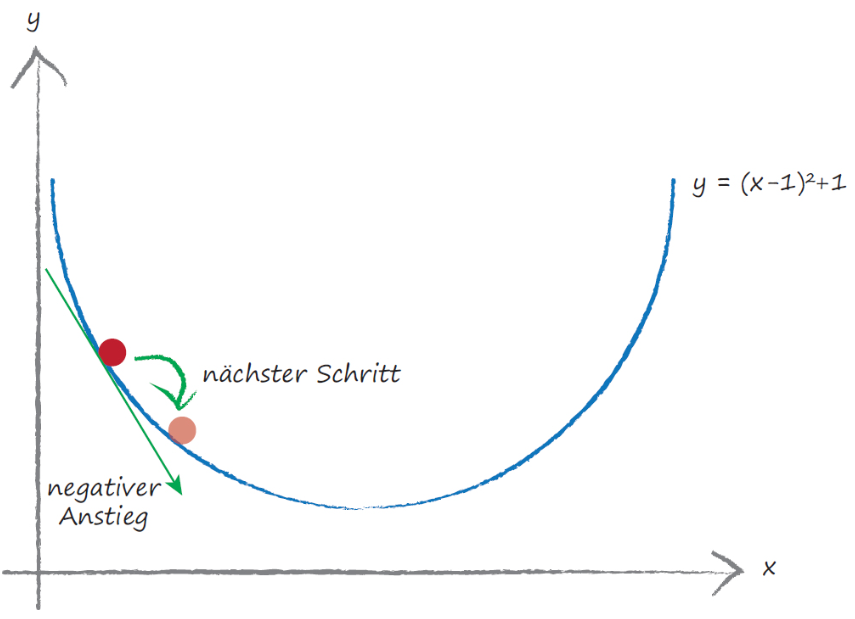
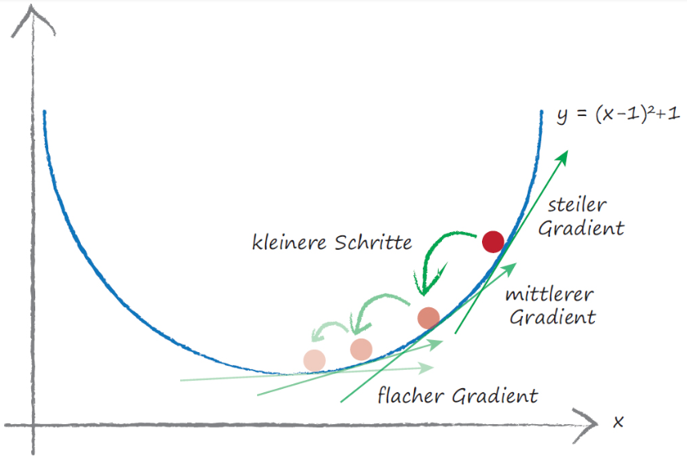
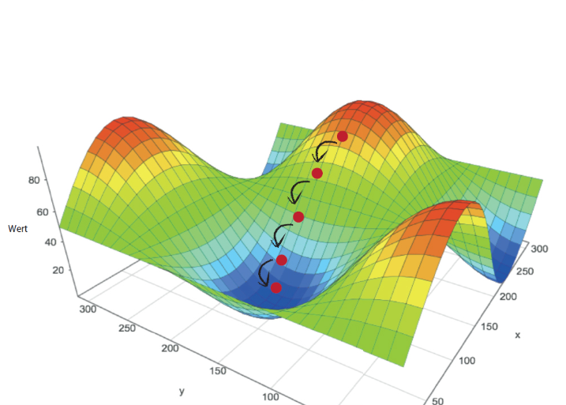
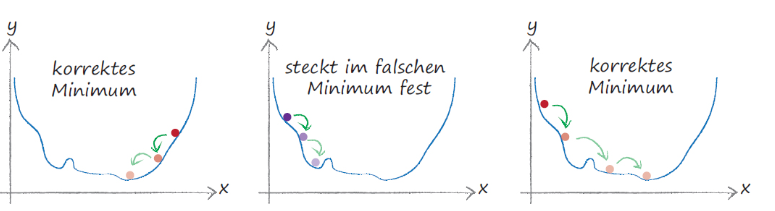
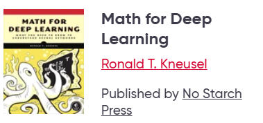

# Wie werden die Gewichte aktualisiert
Ref.: Buch *Neuronale Netze, Tariq R. O'REILLY*. 

Ein Modell trainieren heisst, die unbekannten Parameter zu bestimmen. Bei der linearen Regression mit dem LMS-Algorithmus (Least Mean Squares) in 2D sind die Gewichte oder Modellparameter die Steigung $m$ und der y-Achsenabschnitt $b$ der Geraden $f(x)= mx + b$ , welche wir suchen. Die Normalengleichung, welche exakt die optimalen Parameter liefert, ist für grosse Datensätze nicht anwendbar, weil das invertieren der Matrix $(A^T A)^{-1}$ dann nicht mehr effizient ist. Auch gibt es viele Modelle, wo keine Formel für Lösung existiert. 

Wir könnten alle Gewichte ausprobieren, bis wir eine gute Kombination gefunden haben. Diese Idee kann sogar nützlich sein, bei schwierigen Problemen, indem wir zufällig Kombinationen austesten. Dieses Vorgehen heisst *Brute Force Methode* und führt in der Praxis nicht zu den optimalen Gewichten, weil zu viele Kombinationen existieren.

Die Lösung heisst *Gradient Descent*. Damit können die optimalen Parameter eines Modells effizient ermittelt werden.

Das Vorgehen entspricht dem Abstieg ins Tal in einer bergigen Landschaft, welche wir nicht kennen und nur in unserer unmittelbaren Nähe erkunden können. Wir suchen die Richtung des grössten Abstiegs, gehen eine kurze Strecke in diese Richtung und beginnen erneut. Dies wiederholen wir so oft, bis wir den tiefsten Punkt gefunden haben. Die bergige Landschaft mit der Höhe über Meer entspricht der Fehler- oder Verlustfunktion unseres Modells, welchen wir minimieren wollen. Die Koordinaten der Berggängerin entsprechen dabei den Gewichten, hier im 2D mit Längen- und Breitengrad für zwei Gewichte. Das Verfahren fünktioniert analog auch im mehrdimensionalen Raum. 

Betrachten wir ein einfaches Beispiel anhand der Funktion $y=(x-1)^2+1$. Den Fehler $y$ wollen wir minimieren und wir suchen das $x$ dazu. Der Ausgangspunkt ist zufällig und wir schauen, in welche Richtung $y$ kleiner wird, und gehen ein kleines Stück in diese Richtung. 

Der Gradient zeigt in die Richtung des stärksten Anstiegs der Funktion, sowie die Grösse dieses Anstiegs. 
Für die Minimierung gehen wir deshalb in die entgegengesetzte Richtung. Die Schrittgrösse, wird zusätzlich durch die Lernrate skaliert.

Bei zwei Parametern veranschaulicht die folgende Darstellung das Gradientenverfahren. 

Da wir uns nur lokal orientieren können, ist es nicht ausgeschlossen, dass wir ein lokales Minimum finden. Oder bei zu grossen Schritten finden wir das Minimum gar nicht.

Mit dem Gradientenverfahren wollen wir anhand von vielen Trainingsdaten 

- den Fehler unseres linearen Regressions-Modells minimieren. D.h. wir suchen das Minimum der sogenannten *Loss Function* oder Fehlerfunktion. 
- die Wahrscheinlichkeit unseres logistischen Regressions-Modells maximieren. D.h. wir suchen das Maximun der *log likelihood Funktion*. 

# Von der Intuition zur mathematischen Beschreibung
Die Idee des Gradientenverfahrens lässt sich mathematisch mit dem Begriff der Ableitung beschreiben. Die Ableitung gibt an, wie stark sich die Funktion verändert, wenn wir einen Modellparameter ein kleines Stück verändern. Sie enthält also genau die Information, die wir für den „Abstieg ins Tal“ benötigen: in welche Richtung wir gehen müssen und wie gross der nächste Schritt sein sollte. Bei nur einem Parameter entspricht dies der Steigung der Kurve an der aktuellen Stelle. Bei mehreren Parametern spricht man vom Gradienten. Dieser fasst die partiellen Ableitungen nach allen Parametern zusammen und zeigt damit die Richtung des stärksten Anstiegs an. Um den Fehler zu verkleinern, bewegen wir uns deshalb entgegen der Gradientenrichtung.

Das **Gradientenverfahren** geschieht nun iterativ. Für zufällige Startwerte bestimmen wir die Änderung. Für $L(b,m)$ sieht die sogenannte *Update-Rule* wie folgt aus:

$$m_{neu} = m_{vorher} - \alpha \frac{\Delta L}{\Delta m}$$
$$b_{neu} = b_{vorher} - \alpha \frac{\Delta L}{\Delta b}$$

Dabei ist $\alpha$ die **Lernrate**. Sie bestimmt die Schrittgrösse. Befinden wir uns beim Minimum, ist $\Delta L \approx 0$ und die Gewichte ändern sich praktisch nicht mehr. 

Die Wahl von $\alpha$ ist wichtig. Ist die Schrittlänge zu gross, pendeln wir um das Minimum herum. Ist $\alpha$ zu klein, brauchen wir zu viele Schritte und das Verfahren dauert zu lange. 

> #### Hinweis zur Differentialrechnung (nicht Prüfungsrelevant)
> Der Ausdruck $\frac{\Delta L}{\Delta m}$ heisst mathematisch die **partielle Ableitung** von $L$ nach $m$ und wird als 
>
> $$ \frac{\partial L}{\partial m}$$
> geschrieben.
> Bei einer Funktion $f(x)$ mit nur einem Argument ist das sie **Ableitung** von $f$ nach $x$ und wird geschrieben als 
> $$\frac{df}{dx}$$
>
> Der **Gradient** wird auch mit dem Nabla Symbol $\nabla$ geschrieben und ist ein Vektor mit allen partiellen Ableitungen 
> $$
\nabla L(\mathbf{w}) =
\begin{pmatrix}
\frac{\partial L}{\partial m} \\[4pt]
\frac{\partial L}{\partial b}
\end{pmatrix}
> $$
> $$
\mathbf{w} =
\begin{pmatrix}
m \\
b
\end{pmatrix}
> $$
> Die Ableitungen können mit Hilfe der Differentialrechnung bestimmt werden, worauf wir hier nicht weiter eingehen. 

# Das Gradientenverfahren im Detail

Für den referenzierten Python Code, gibt's ein [github repo](https://github.com/rkneusel9/MathForDeepLearning). siehe dazu 

- Chapter 11
    - gd_1d.py
    - gd_2d.py

Das Kapitel 11 ist hier zum Download [Ch11 erster Teil](../assets/ch11_Kneusel_Math_for_Deep_Learning.pdf)

Num folgt eine Zusammenfassung der wichtigsten Inhalte daraus.

## Was ist Gradient Descent?

Ein iterativer Algorithmus, der **schrittweise ein Minimum einer Funktion sucht**.
In Deep Learning wird damit der Fehler eines Modells minimiert, indem Gewichte
und Biases angepasst werden.

---

## Das Grundprinzip

Der Gradient (= Ableitung) zeigt in die Richtung des **steilsten Anstiegs**.
Weil wir minimieren wollen, bewegen wir uns in die **entgegengesetzte Richtung** —
daher der Name „Descent" (Abstieg).

$$
x_{neu} = x_{altes} − \eta \cdot \text{Gradient}
$$

---

## Die Lernrate η – der wichtigste Parameter

| Lernrate | Effekt |
|---|---|
| **Zu klein** | Viele Schritte nötig, Training sehr langsam |
| **Zu groß** | Schritte „überspringen" das Minimum, Algorithmus oszilliert |
| **Passend** | Gleichmäßige, stabile Konvergenz zum Minimum |

**Merke:** Es gibt keinen universell richtigen Wert — Intuition und Erfahrung sind
gefragt. In modernen Netzen ist η oft **nicht konstant**, sondern wird während des
Trainings automatisch angepasst.

---

## 1D vs. 2D – das Prinzip bleibt gleich

In einer Dimension folgt man der Steigung der Kurve. In zwei Dimensionen folgt
man den **partiellen Ableitungen** in jede Richtung — das Prinzip ist identisch,
nur dass man sich auf einer „Landschaft" bewegt statt auf einer Kurve.

---

## Wichtige Beobachtung: Form der Funktion

Wenn die Funktion in einer Richtung sehr steil und in einer anderen sehr flach ist
(wie ein schmales Tal), kann Gradient Descent sehr **langsam werden** — der Gradient
entlang des flachen Bodens ist klein, also sind die Schritte klein. Das ist ein
häufiges Problem in der Praxis.

---

## Fortgeschrittene Optimierer (Ausblick)

Vanilla Gradient Descent hat Schwächen, deshalb gibt es Weiterentwicklungen:

- **Momentum** – nutzt die „Bewegungsrichtung" der letzten Schritte, um träge über flache Regionen zu kommen
- **RMSprop** – passt die Lernrate pro Parameter individuell an
- **Adam** – kombiniert Momentum + RMSprop, Standard in der Praxis

---

## Fazit

1. Gradient Descent **sucht kein exaktes Minimum** — er nähert sich iterativ an
2. Die **Lernrate ist der kritischste Hyperparameter**
3. Zu kleine η → langsam; zu große η → instabil
4. Die **Form der Verlustlandschaft** beeinflusst die Geschwindigkeit stark
5. In der Praxis nutzt man immer einen der **adaptiven Optimierer**

