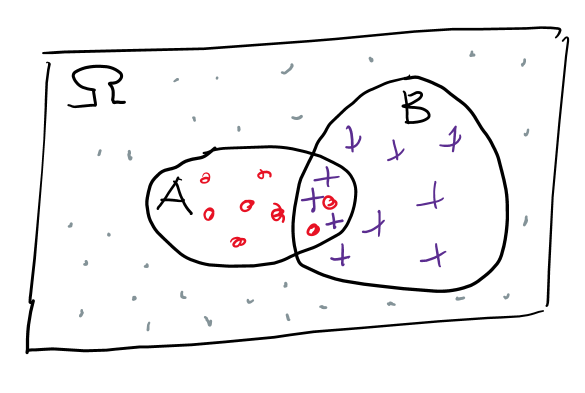

# Literatur
- Kapitel *Bayes' Theorem*, Math for deep learning, Kneusel, no starch press. 
- [https://web.stanford.edu/class/archive/cs/cs109/cs109.1218/files/student_drive/9.3.pdf](https://web.stanford.edu/class/archive/cs/cs109/cs109.1218/files/student_drive/9.3.pdf)

# Motivation
Hast du dich schon mal gewundert, wie eine E-Mail als Spam markiert wird? Einer der klassischen Ansätze in den frühen Spamfiltern bestand darin, mit Wahrscheinlichkeiten zu arbeiten - insbesondere mit dem dem *Bayes' Theorem*. 

Dieser sehr naive Ansatz, wie wir noch sehen werden, funktioniert für viele Klassifizierungsprobleme überraschend gut, so auch zum Klassifizieren von E-Mails. 

Um den sogenannten *Naive Bayes Classifier* zu verstehen und auf eigene Problemstellungen anwenden zu können, benötigen wir zunächst einige Grundbegriffe aus der Wahrscheinlichkeitsrechnung. 

# Grundbegriffe der Wahrscheinlichkeitsrechnung

#### Definitionen
Ein *Zufallsexperiment* ist ein Vorgang, dessen Ergebnis nicht mit Sicherheit vorhergesagt werden kann, dessen mögliche Ergebnisse jedoch bekannt sind.

Die Menge aller möglichen Ergebnisse eines Zufallsexperiments heißt *Ergebnisraum* (*sample space*) und wird üblicherweise mit $\Omega$. 

Ein *Ereignis* (*event*) ist eine Teilmenge des Ergebnisraums. Ein einzelnes mögliches Ergebnis eines Zufallsexperiments nennt man *Elementarereignis*.

*Laplace-Experimente* sind Zufallsexperimente bei denen jedes Elementarereignis die gleiche Wahrscheinlichkeit besitzt. 

Die *Wahrscheinlichkeit* eines Ereignisses $A \subseteq \Omega$ ist eine Zahl zwischen $0$ und $1$ und berechnet sich bei Laplace-Experimenten als
$$\mathbb{P}(A) = \frac{\text{Anzahl der günstigen Ergebnisse}}{\text{Anzahl der möglichen Ergebnisse}} = \frac{|A|}{|\Omega|}$$

**Beispiel 1:** 
Wir messen den Glukosewert eines Patienten und klassifizieren ihn als diabetisch oder nicht-diabetisch. Da wir den Glukosewert nicht im Voraus kennen, ist das Ergebnis für uns zufällig. 
$$ \Omega = \{\text{diabetisch}, \text{nicht-diabetisch}\}$$
Dies ist kein Laplace-Experiment, da die beiden Ergebnisse nicht gleich wahrscheinlich sind. 

**Beispiel 2:**
Wir werfen einen fairen Würfel. Der Ausgang des Würfelexperiments ist zufällig. Da alle sechs Augenzahlen gleich wahrscheinlich sind, handelt es sich um ein Laplace-Experiment.
$$\Omega = \{1,2,3,4,5,6\}$$

Die Wahrscheinlichkeit für das Ereignis $W$ *die gewürfelte Zahl ist gerade* berechnet sich wie folgt:
$$\mathbb{P}(W) = \frac{|\{2,4,6\}|}{|\{1,2,3,4,5,6\}|} = \frac{3}{6}$$
 
**Beispiel 3:**
Wir werfen zwei faire Würfel. Ein Ergebnis ist nun ein Zahlenpaar. Der Ergebnisraum besteht aus 36 gleich wahrscheinlichen Elementarereignissen.
$$\Omega = \{(1,1), (1,2), \ldots, (6,5), (6,6)\}$$

Die Wahrscheinlichkeit für das Ereignis $E$ *gewürfelte Summe > 7* lässt sich berechnen, indem alle günstigen Kombinationen gezählt werden.
$$E = \{(2,6) (6,2) (3,5) (5,3) (3,6) (6,3) (4,4) (4,5) (5,4) (4,6) (6,4) (5,5) (5,6) (6,5) (6,6)\}$$
$$\mathbb{P}(Summe \gt 7) = \frac{|E|}{|\Omega|} = \frac{15}{36}$$

# Bedingte Wahrscheinlichkeit und das Theorem von Bayes
Wir betrachten einen Ergebnisraum $\Omega$ sowie zwei Ereignisse $A$ und $B$. 

Dann gilt 

$$\mathbb{P}(A) = \frac{|A|}{|\Omega|} \text{,\;\;\;} \mathbb{P}(B) = \frac{|B|}{|\Omega|}$$

> #### Definition
> Die bedingte Wahrscheinlichkeit beschreibt die Wahrscheinlichkeit eines Ereignisses $A$, **gegeben dass** ein anderes Ereignis $B$ bereits eingetreten. Sie ist definiert als
>
> $$\mathbb{P}(A | B) = \frac{\mathbb{P}(A \cap B)}{\mathbb{P}(B)} = \frac{\frac{A \cap B}{|\Omega|}}{\frac{|B|}{|\Omega|}} = \frac{|A \cap B|}{|B|}, \;\; B \ne \emptyset$$

Es gilt ausserdem

$$\mathbb{P}(A | B) = \frac{\mathbb{P}(A \cap B)}{\mathbb{P}(B)}$$

und aufgrund der Symmetrie

$$\mathbb{P}(B | A) = \frac{\mathbb{P}(B \cap A)}{\mathbb{P}(A)}$$

durch Gleichsetzen von $\mathbb{P}(A \cap B) = \mathbb{P}(B \cap A)$ erhalten wir das **Theorem vom Bayes**

$$\mathbb{P}(A | B) = \frac{\mathbb{P}(B|A) \; \mathbb{P}(A)}{\mathbb{P}(B)}$$

# Naive Bayes Classifier
Todo

