### Hint: To convert MD to PDF follow the steps below
1. In VS Code install *Markdown PDF* Plugin. 
2. Open the Markdown file
3. Press F1 or Ctrl+Shift+P
4. Type export and select below
    - markdown-pdf: Export (pdf)
    - PNG, HTML etc. available to


# Was ist maschinelles Lernen?
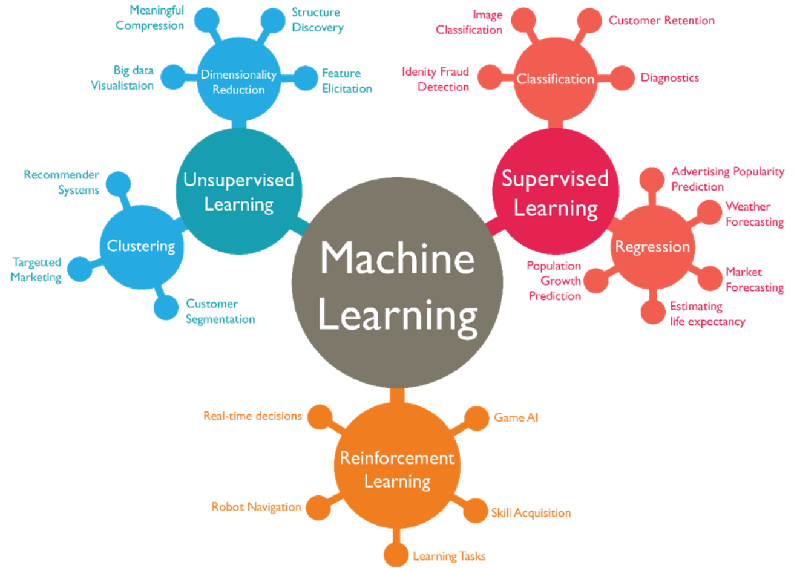

Quelle: www.reddit.com

- **Supervised learning** Mit Hilfe von Trainingsdaten die Parameter eines Computermodells festlegen, also die Parameter "lernen", so dass für unbekannte Daten möglichst korrekte Aussagen gemacht werden können. Wir unterscheiden
    - Lineare Regression - Vorhersage eines kontinuierlichen Wertes. Beispiel: Hauspreis anhand von Grösse, Lage und Alter.
    - Klassifikation - Vorhersage einer Kategorie. Beispiel: Ein neues Email als Spam identifizieren. Für Klassifikation benutzen wir unter anderen **logistische Regression*. Auf dem Bild oben wird das nicht unterschieden.
- **Unsupervised learning** Der Computer erhält unbekannte Daten und findet selbständig darin Muster und Strukturen. Beispiel: Ein Unternehmen gruppiert Kunden automatisch nach Kaufverhalten, ohne vorher Gruppen zu definieren. 
- **Reinforced learning** Der Computer lernt von eigenen Entscheidungen und Aktionen. Dabei wird eine Belohnungsfunktion verwendet und der Computer maximiert die Belohnung durch Versuche. Beispiel: Ein Computer spielt Schach und wird für einen Sieg oder einen guten Zug belohnt. 

# Intro - Supervised Learning
## Lineare Regression

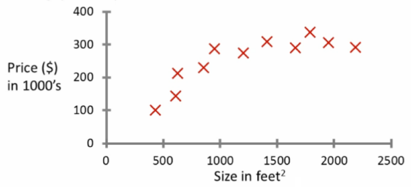

Gegeben diese Daten, ein Freund besitzt ein Haus mit 750 $\text{feet}^2$. Was ist der Wert der Immobilie?

Wir werden das Problem auf eine bewährte Art lösen, indem wir ein Polynom von Grad 1 oder höher bestimmen, welches die Daten bestmöglich repräsentiert. 

## Classification Problem

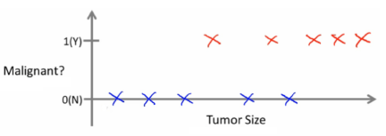

Können wir eine Prognose basierend auf der Grösse machen, ob ein Tumor bösartig ist oder nicht?

Um dieses Problem zu lösen, werden wir die Parameter für ein Modell bestimmen, welches für eine beliebige Tumorgrösse, die Wahrscheinlichkeit angibt, dass der Tumor bösartig ist oder nicht. Ist die Wahrscheinlichkeit $\gt 0.5$ nehmen wir an, der Tumor ist bösartig, sonst harmlos. 

# Intro - Unsupervised Learning
Bei Unsupervised learning betrachten wir nicht gekennzeichnete Daten und versuchen diese zu Strukturieren und Muster zu erkennen. 

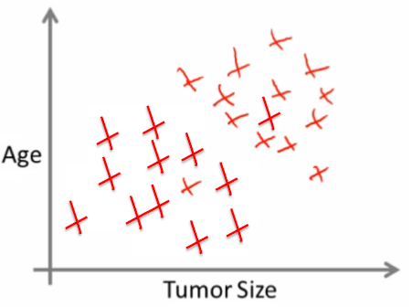


# Reinforcement Learning

Hier ist die Grundidee eine Belohnungsfunktion (reward function).


Bildquelle: Boston Dynamics

Beim Roboter wird ein Schritt in die richtige Richtung ohne Sturz belohnt. Der Roboter lernt so die guten Schritte aus vielen Fehlern. Bei einem Schachcomputer wird ein guter Zug belohnt. Eine Metrik entscheidet, wie gut ein Schachzug ist. Auch ein Sieg der Partie kann belohnt werden. Schachzüge gibt es viel mehr als Siege, darum kann es effizienter sein, eine Belohnungsfunktion für die Schachzüge zu finden und anhand deren zu lernen.  

# Einführung in wichtige Konzepte
## Sage den Preis eines Hauses voraus, bei gegebener Grundfläche

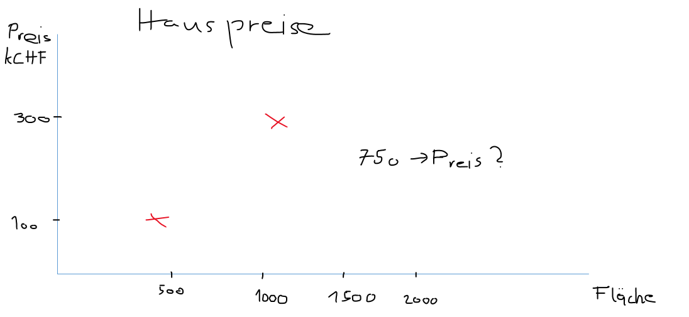

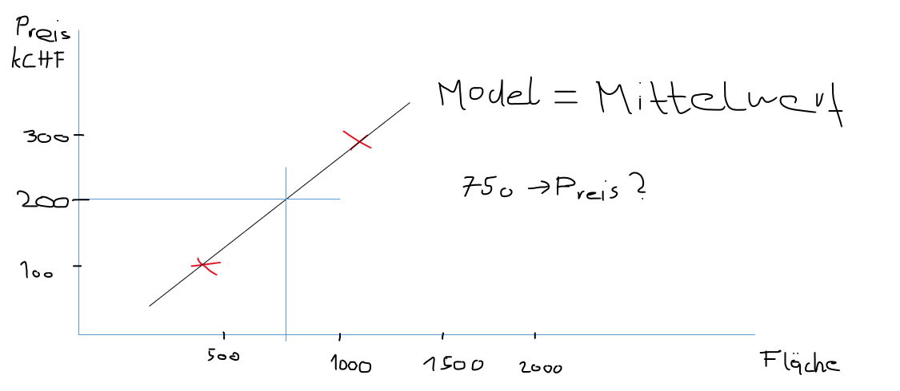

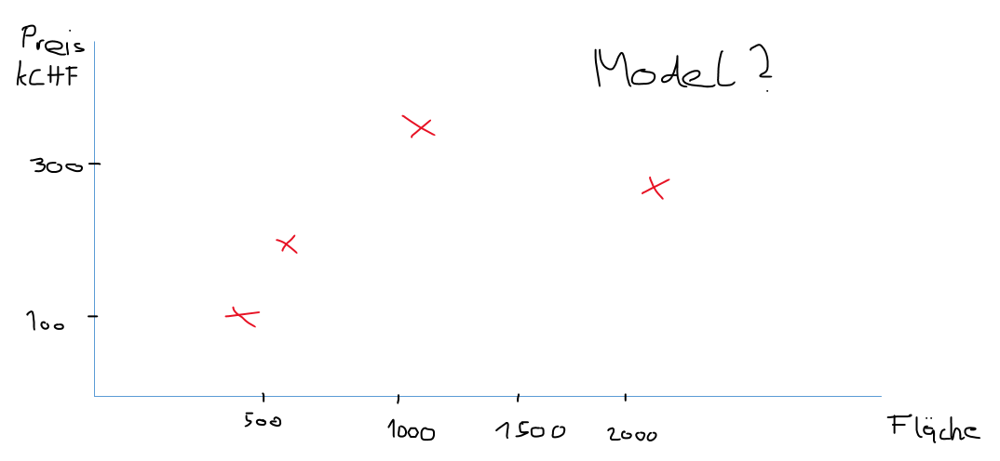

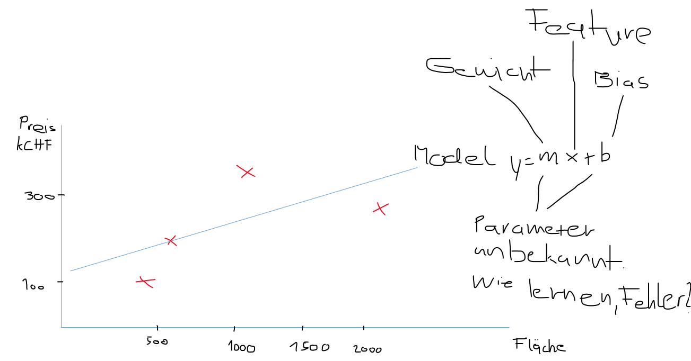

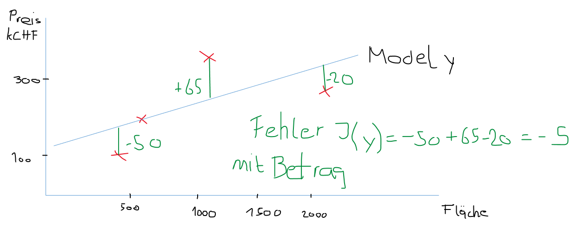

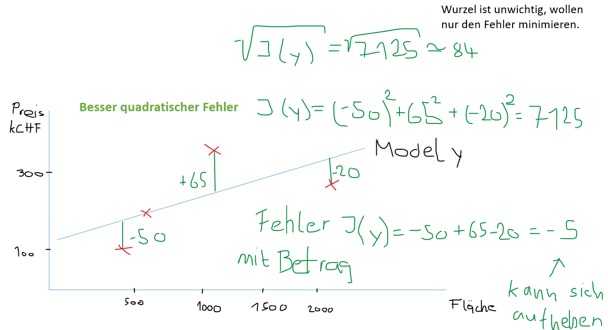

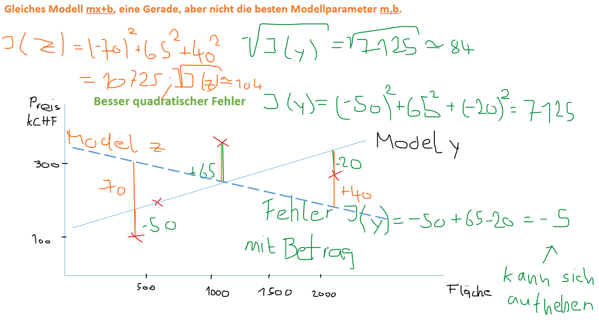

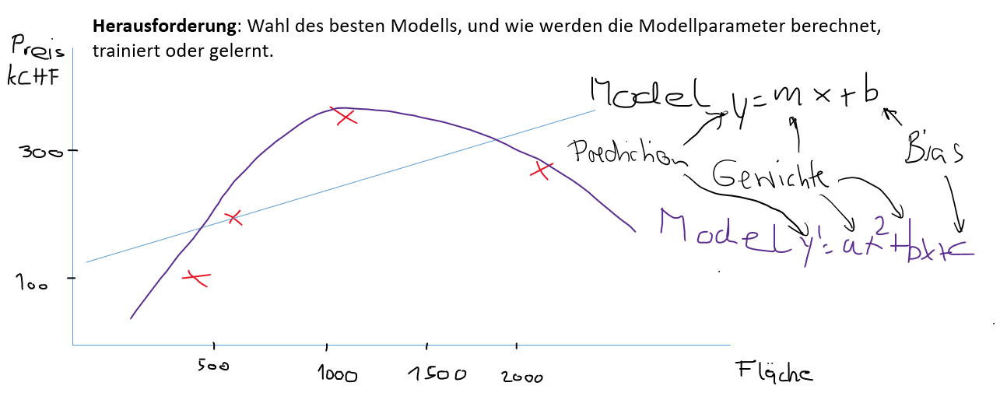


# Fazit
Das Beispiel mit der Vorhersage des Hauspreises fällt unter Supervised Learning.

Um die Modellparameter (Gewichte) zu lernen oder trainieren, betrachten wir eine Fehlerfunktion $J(w)$, welche es zu minimieren gibt. 

Die Trainingsdaten, wo die Features und das Resultat bekannt sind, werden genutzt, um die Gewichte zu finden, für welche $J(w)$ minimal wird. Eine geeignete Methode dafür ist die lineare Regression, welche wir noch kennen lernen. 

Um diese zu verstehen und um das Modell zu beschreiben und auch zu trainieren, brauchen wir einige Werkzeuge aus der linearen Algebra. Damit können wir dann auch die optimierten Methoden aus ```numpy``` und ```scikit``` verstehen und anwenden. 

Mehr davon im Kapitel 2.

$$\text{Viel Spass!}$$


