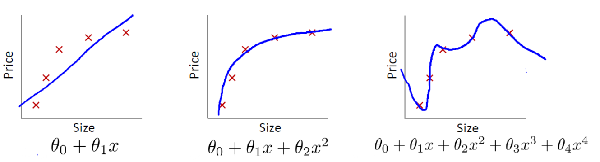

## Inhaltsverzeichnis

- [Vektoren im maschinellen Lernen](#vektoren-im-maschinellen-lernen)
- [Definition (Lineares Gleichungssystem)](#definition-lineares-gleichungssystem)
- [Beispiel: Polynom durch Datenpunkte](#beispiel-polynom-durch-datenpunkte)
- [Die Idee der inversen Matrix](#die-idee-der-inversen-matrix)
- [Lineare Regression und Overfitting](#lineare-regression-und-overfitting)
- [Ausblick](#ausblick)


# Einleitung
Im maschinellen Lernen werden grosse Datenmengen verarbeitet. Die Daten werden in Vektoren (1 dimensonale Listen) oder Matrizen (2 Dimensionale Listen, also eine Liste von Listen) erfasst und den Algorithmen und Methoden als Input übergeben. Eine Methode kann auch wieder einen Vektor als Returnwert zurückgeben.

Wichtige Begriffe sind hierbei sind:
- Features
- Weights
- Bias
- Skalarprodukt (=Dot-Product)

## Vektoren im maschinellen Lernen
Oft arbeiten wir mit Vektoren. 
- Ein **Feature Vektor** repräsentiert einen Datenpunkt
$$x=
\begin{pmatrix}
x_1 \\
x_2 \\
\vdots \\
x_n
\end{pmatrix}
$$

Jedes $x_i$ ist ein Feature, z.B. $x_1$ die Hausgrösse, $x_2$ die Anzahl Zimmer, $x_3$ die die Entfernung zur nächsten Bushaltestelle. 

Die einzelnen Zahlen eines Vektors werden auch Komponenten genannt. 

- Ein **Weight Vektor** repräsentiert die Gewichtung eines jeden Features

$$w=
\begin{pmatrix}
w_1 \\
w_2 \\
\vdots \\
w_n
\end{pmatrix}
$$

Üblich ist nebst $w$ manchmal auch $\theta$ als Bezeichnung für Gewichte.

## Gewichtete Summe
Jedes Feature $x_i$ trägt zum Ergebnis bei. Das Gewicht $w_i$ kontrolliert, wie wichtig dieses Feature ist. Je grösser $|w_i|$, desto stärker der Einfluss. Die reelle Zahl $y$, welche dabei als Ergebnis resultiert, berechnet sich somit wie folgt:

$$
y= w_1x_1 + \ldots + w_nx_n = \sum_{i=1}^{n} w_ix_i
$$

und ist die **gewichtete Summe**. 

Wenn also ein Modell trainiert oder gelernt wird, heisst das, dass die Gewichte bestimmt werden. 

## Das Skalarprodukt als gewichtete Summe
Das Skalarprodukt oder auch als *Dot Product* bezeichnet, ist für zwei Vektoren $x$ und $w$ mit gleicher Anzahl Komponenten wie folgt definiert:

$$
w \cdot x = w_1x_1 + \ldots + w_nx_n
$$

In Vektor schreibweise etwas kürzer und oft verwendet als

$$
w \cdot x = w^T x = 
\begin{pmatrix}
w_1 & w_2 & \ldots & w_n
\end{pmatrix}

\begin{pmatrix}
x_1 \\
x_2 \\
\vdots \\
x_n
\end{pmatrix}
$$

### Eigenschaften
- linear in beiden Argumenten
- kommutativ
- Ergebnis ist eine reelle Zahl
- Ist das Skalarprodukt $0$ stehen die Vektoren senkrecht aufeinander. 

### Der Bias Anteil
Sind alle Features $0$ ist auch die gewichtete Summe $0$. Das ist jedoch für ein Modell nicht immer sinnvoll und zutreffend. Z.B. sind die Betriebskosten eines Autos nicht $0$ wenn nicht damit gefahren wird.

Der Bias ist ein Offset und kann die gewichtete Summe verschieben. Die gewichtete Summe wir um den Bias ergänzt und so als Modell oder als Input für eine Methode wie folgt berechnet:

$$
y = w \cdot x +b, \;\;\; w,x \in \mathbb{R}^n, b \in \mathbb{R}
$$


# Definition (Lineares Gleichungssystem)

Seien $m,n \in \mathbb{N}$.  
Ein *lineares Gleichungssystem* mit $m$ Gleichungen und $n$ Unbekannten besteht aus Gleichungen der Form

$$
\sum_{j=1}^{n} a_{ij} x_j = b_i 
\quad \text{für } i = 1,\dots,m,
$$

wobei $a_{ij}, b_i \in \mathbb{R}$ gegebene Zahlen sind und $x_1,\dots,x_n$ die Unbekannten bezeichnen. 

In Matrixschreibweise schreibt man das System kompakt als

$$
Ax = b,
$$

wobei $A \in \mathbb{R}^{m \times n}$ die Koeffizientenmatrix,  
$x \in \mathbb{R}^n$ der Vektor der Unbekannten und  
$b \in \mathbb{R}^m$ der bekannte Vektor auf der rechten Seite bezeichnen.

$a_{i,j}$ bezeichnet das Matrixelement in der $i$'ten Zeile und $j$'ten Spalte. Wobei $i,j \ge 1$. 

Eine *Lösung* ist ein Vektor $x \in \mathbb{R}^n$, der die Gleichung $Ax = b$ erfüllt.


## Beispiel: Polynom durch Datenpunkte

Viele praktische Probleme lassen sich als lineare Gleichungssysteme formulieren. Ein wichtiges Beispiel ist die Bestimmung eines Polynoms, das durch gegebene Datenpunkte verläuft.

Wir suchen ein Polynom dritten Grades

$$
p(x) = ax^3 + bx^2 + cx + d,
$$

das durch vier gegebene Punkte  
$(x_1, y_1), (x_2, y_2), (x_3, y_3), (x_4, y_4)$ verläuft.

Durch Einsetzen der $x_i$ entstehen vier Gleichungen für die unbekannten Koeffizienten $a, b, c, d$:

$$
\begin{aligned}
a x_1^3 + b x_1^2 + c x_1 + d &= y_1, \\
a x_2^3 + b x_2^2 + c x_2 + d &= y_2, \\
a x_3^3 + b x_3^2 + c x_3 + d &= y_3, \\
a x_4^3 + b x_4^2 + c x_4 + d &= y_4.
\end{aligned}
$$

Dieses System hat vier Gleichungen und vier Unbekannte und lässt sich in Matrixform schreiben als

$$
\begin{pmatrix}
x_1^3 & x_1^2 & x_1 & 1 \\
x_2^3 & x_2^2 & x_2 & 1 \\
x_3^3 & x_3^2 & x_3 & 1 \\
x_4^3 & x_4^2 & x_4 & 1
\end{pmatrix}
\begin{pmatrix}
a \\ 
b \\ 
c \\ 
d
\end{pmatrix}=
\begin{pmatrix}
y_1 \\ 
y_2 \\ 
y_3 \\ 
y_4
\end{pmatrix}
$$

Das Lösen solcher Systeme ist eine zentrale Aufgabe der linearen Algebra.  
Typische Verfahren sind das Gauß-Verfahren oder numerische Methoden. Im Folgenden betrachten wir die Lösung mit der Idee der inversen Matrix.


## Die Idee der inversen Matrix

Gegeben sei ein lineares Gleichungssystem

$$
A x = b, 
\qquad 
A \in \mathbb{R}^{n \times n}, 
\quad 
x,\, b \in \mathbb{R}^n.
$$

Gesucht ist ein Vektor $x$, sodass $Ax = b$ gilt.

Falls die Matrix $A$ invertierbar ist, existiert eine Matrix $A^{-1}$ mit

$$
A^{-1}A = AA^{-1} = I,
$$

wobei $I$ die Einheitsmatrix ist.

Multipliziert man die Gleichung $Ax = b$ von links mit $A^{-1}$, erhält man direkt

$$
x = A^{-1} b.
$$

Das bedeutet: Ist $A^{-1}$ bekannt, kann die Lösung unmittelbar berechnet werden.

**Bemerkungen:**  

In realen Anwendungen mit grossen Matrizen wird die Inverse nicht berechnet, stattdessen werden effizientere Verfahren angewendet.

Nicht jede quadratische Matrix ist invertierbar. Falls die Zeilen oder Spalten von $A$ linear abhängig sind, existiert keine Inverse und die Matrix ist *singulär*. In diesem Fall hat das Gleichungssystem entweder keine Lösung oder unendlich viele Lösungen.  Vektoren sind linear abhängig, falls ein Vektor durch eine Linearkombination der anderen dargestellt werden kann. 

*Beispiel*: Die Matrix

$$
\begin{pmatrix}
1&4&1 \\
-1&2&-4 \\
0&2&-1
\end{pmatrix}
$$

ist nicht invertierbar weil

$$
3\begin{pmatrix}
1 \\ 
-1 \\ 
0
\end{pmatrix}- 
\frac{1}{2}
\begin{pmatrix}
4 \\
2 \\
2 
\end{pmatrix}=
\begin{pmatrix}
1 \\
-4 \\
-1 
\end{pmatrix}
$$

Dabei sind $3$ und $-\frac{1}{2}$ die Linearfaktoren. 

## Die Berechnung der inversen Matrix
nimmt uns die Funktion ```numpy.linalg.inv``` ab.

Um direkt das Gleichungssystem $Ax=b$ zu lösen, ist die Funktion ```numpy.linalg.solve``` effizienter. 

---

# Lineare Regression und Overfitting

Das obige Beispiel führt uns zu zwei grundlegenden Konzepten aus dem maschinellen Lernen: 

- lineares Modell,
- Minimieren des Fehlers durch lineare Regression und
- Overfitting

Ein **lineares Modell** beschreibt den Zusammenhang zwischen einer Eingabe $x$ und einer Ausgabe $y$ durch eine Gleichung der Form:

$$
y=a_0+a_1 x_1 + a_2 x_2 + \ldots  + a_n x_n
$$

*Linear* bedeutet hier nicht, dass die Kurve eine Gerade ist, sondern dass das Modell linear in den Parametern $a_0,a_1, \ldots ,a_n$​ ist. Auch ein Polynom wie

$$
y=a_0+a_1 x+a_2 x^2
$$

ist ein lineares Modell, weil die Parameter $a_i$ nur linear, also nicht z.B. als $a_1^2$ oder $a_1 \cdot a_2$ auftreten.

Bei der **linearen Regression** hat man eine Menge von Datenpunkten $(x_i, y_i)$ gegeben und sucht die Parameter $a_0,a_1, \ldots,a_n$​, sodass das lineare Modell die Daten möglichst gut beschreibt, d.h. der Fehler zwischen Modell und Datenpunkten minimiert wird. Das Modell kann dann genutzt werden, um Vorhersagen für neue, unbekannte $x$-Werte zu treffen.

Das Polynom

$$
p(x) = ax^3 + bx^2 + cx + d
$$

ist ein solches Modell. Die Koeffizienten $a, b, c, d$ nennt man *Parameter*, die aus den Daten bestimmt bzw. gelernt werden.

Im obigen Beispiel wird gefordert, dass das Polynom alle Punkte exakt trifft. Man spricht von *exakter Anpassung*.

In der Praxis ist eine exakte Anpassung nicht anwendbar, weil

- Reale Daten enthalten Rauschen (Messfehler, Zufallseinflüsse).
- Ein zu komplexes Modell kann dieses Rauschen „mitlernen“.

Dieses Phänomen nennt man *Overfitting*:  
Das Modell passt perfekt zu den Trainingsdaten, liefert aber schlechte Vorhersagen für neue Daten.

Das folgende Bild zeigt links eine Gerade als Modell, welches zu vereinfacht ist, in der Mitte ein Polynom vom Grad 2, welches die Daten gut modelliert und rechts ein Polynom von Grad 5, welches den Effekt des Overfitting zeigt. Hier stimmen die Trainingsdaten exakt. Neue, unbekannte Hausgrössen werden aber den Preis nicht gut vorhersagen. 



Bildquelle: [Andrew Ng](https://zhu45.org/posts/2017/Jul/21/andrew-ngs-ml-week-06-11/)

# Ausblick
Im nächsten Abschnitt über **Least-Means-Squares (LMS) und die Normalengleichung** betrachten wir Anwendungen der linearen Algebra für maschinelles Lernen. 

$$\text Viel \: Spass!$$
