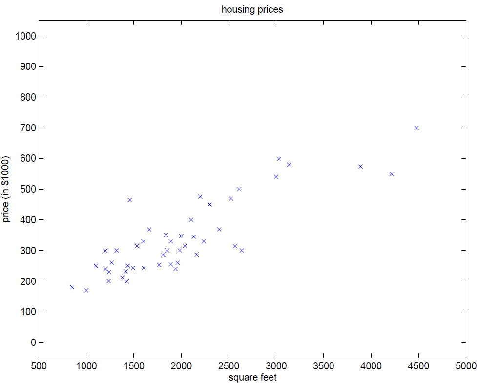

## Inhaltsverzeichnis

- [Least-Squares-Regression und die Normalengleichung](#least-squares-regression-und-die-normalengleichung)
- [Überbestimmte Systeme](#überbestimmte-systeme)
- [Idee der kleinsten Quadrate](#idee-der-kleinsten-quadrate)
- [Die Normalengleichung](#die-normalengleichung)


## Least-Squares-Regression und die Normalengleichung

Im vorherigen Abschnitt haben wir gesehen, dass ein Polynom dritten Grades durch vier Datenpunkte exakt bestimmt werden kann.  

In der Praxis liegen jedoch meist **mehr Datenpunkte als Modellparameter** vor. Das entstehende Gleichungssystem ist dann *überbestimmt* und besitzt in der Regel **keine exakte Lösung**.

Die zentrale Frage lautet daher:

Wie finden wir ein Modell, das die Daten möglichst gut beschreibt?

Die Antwort liefert das *Least-Squares-Verfahren* (Methode der kleinsten Quadrate).


## Überbestimmte Systeme

Betrachten wir ein lineares Modell im $\mathbb{R}^2$ (eine Gerade $y=mx+b$).  Unsere Hypothese ist somit:
 
$$
h_\theta(x) = \theta_1 x + \theta_0
$$ 

die eine Menge von Punkten $(x_i, y_i)$ möglichst gut approximieren soll. Zum Beispiel um Hauspreise zu bestimmen.



Bildquelle: CS229 Lecture notes
Andrew Ng

Durch Einsetzen der Datenpunkte erhalten wir das lineare Gleichungssystem

$$
A x = y,
$$

mit

$$
A =
\begin{pmatrix}
x_1 & 1 \\
x_2 & 1 \\
\vdots & \vdots \\
x_n & 1
\end{pmatrix},

\qquad
x =
\begin{pmatrix}
\theta_1 \\ \theta_0
\end{pmatrix},
\qquad
y =
\begin{pmatrix}
y_1 \\ y_2 \\ \vdots \\ y_n
\end{pmatrix}.
$$

Für $n > 2$ hat dieses System mehr Gleichungen als Unbekannte und ist daher *überbestimmt*.  
Im Allgemeinen existiert keine exakte Lösung.


## Idee der kleinsten Quadrate

Da keine exakte Lösung existiert, suchen wir stattdessen eine *beste Näherung*.

Die Idee (1801 von Carl Friedrich Gauss entwickelt, um den verlorenen Zwergplaneten [Ceres](https://de.wikipedia.org/wiki/(1)_Ceres) wiederzufinden) besteht darin, den Fehler zwischen Hypothese und Daten zu minimieren. Dieser Fehler wird durch die Summe der quadratischen Abweichung aller Punkte gemessen und als *cost function* wie folgt berechnet:

$$
J(\theta) = \sum_{i=1}^n (h_\theta(x_i) - y_i)^2
$$

Gesucht ist also der Parametervektor $x$, der diesen Fehler minimiert.


## Die Normalengleichung

Das Minimum des Fehlers wird genau dann erreicht, wenn die sogenannte *Normalengleichung* erfüllt ist:

$$
A^\top A x = A^\top y.
$$

Ist die Matrix $A^\top A$ invertierbar, ergibt sich die Lösung explizit als

$$
x  = 
\begin{pmatrix}
\theta_1 \\ \theta_0
\end{pmatrix} =

(A^\top A)^{-1} A^\top y.
$$

**Interpretation:**

- Statt die Daten exakt zu treffen, wird der **Gesamtfehler minimiert**.  
- Die Methode ist robust gegenüber Rauschen in den Daten.  
- Im Gegensatz zur exakten Interpolation entsteht **kein Overfitting**, solange das Modell nicht zu komplex gewählt wird.

### Die Berechnung mit Python
Um die Parameter $\theta_0$ und $\theta_1$ mit der Normalengleichung zu berechnen, können folgende Methoden aus [Numpy linear algebra](https://numpy.org/doc/stable/reference/routines.linalg.html) verwendet werden.

$A^\top$ mit ```numpy.transpose```.

Matrixmultiplikation mit ```numpy.matmul``` oder dem ```@ Operator```. Das gilt auch für die Multiplikation einer Matrix mit einem Vektor. 

Berechnen der Inversen mit ```numpy.linalg.inv```.

Die Funktion ```numpy.linalg.lstsq``` berechnet die LMS Lösung zu einem linearen Gleichungssystem 


