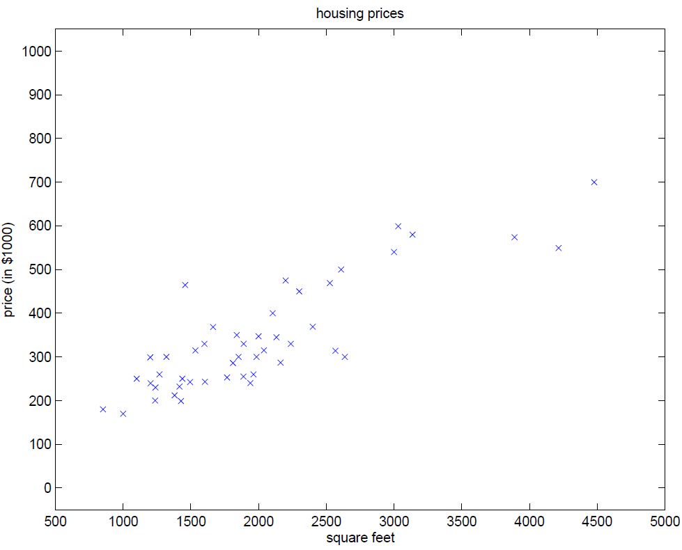

## Inhaltsverzeichnis

- [Least-Squares-Regression und die Normalengleichung](#least-squares-regression-und-die-normalengleichung)
- [Überbestimmte Systeme](#überbestimmte-systeme)
- [Idee der kleinsten Quadrate](#idee-der-kleinsten-quadrate)
- [Die Normalengleichung](#die-normalengleichung)
- [Beispiel](#beispiel)


## Least-Squares-Regression und die Normalengleichung

Im vorherigen Abschnitt haben wir gesehen, dass ein Polynom dritten Grades durch vier Datenpunkte exakt bestimmt werden kann.  

In der Praxis liegen jedoch meist **mehr Datenpunkte als Modellparameter** vor. Das entstehende Gleichungssystem ist dann *überbestimmt* und besitzt in der Regel **keine exakte Lösung**.

Die zentrale Frage lautet daher:

Wie finden wir ein Modell, das die Daten möglichst gut beschreibt?

Die Antwort liefert das *Least-Squares-Verfahren* (Methode der kleinsten Quadrate).


## Überbestimmte Systeme

Betrachten wir ein lineares Modell im $\mathbb{R}^2$ (eine Gerade $y=mx+b$).  Unsere Hypothese ist somit:
 
$$
h_\theta(x) = \theta_1 x + \theta_0
$$ 

die eine Menge von Punkten $(x_i, y_i)$ möglichst gut approximieren soll. Zum Beispiel um Hauspreise zu bestimmen.



Bildquelle: CS229 Lecture notes
Andrew Ng

Durch Einsetzen der Datenpunkte erhalten wir das lineare Gleichungssystem

$$
A \theta = y,
$$

mit

$$
A =
\begin{pmatrix}
x_1 & 1 \\
x_2 & 1 \\
\vdots & \vdots \\
x_n & 1
\end{pmatrix},

\qquad
\theta =
\begin{pmatrix}
\theta_1 \\ \theta_0
\end{pmatrix},
\qquad
y =
\begin{pmatrix}
y_1 \\ y_2 \\ \vdots \\ y_n
\end{pmatrix}.
$$

Lass dich nicht durch die Notation mit dem $\theta$ verwirren. Die Unbekannten sind die Gewichte des Modells, also $\theta_0, \theta_1$. Bekannt sind die Trainingsdaten $x_1, \ldots, x_n$, zu welchen wir den jeweiligen Hauspreis $y_1, \ldots, y_n$ kennen.  

Für $n > 2$ hat dieses System mehr Gleichungen als Unbekannte und ist daher *überbestimmt*.  
Im Allgemeinen existiert keine exakte Lösung.


## Idee der kleinsten Quadrate

Da keine exakte Lösung existiert, suchen wir stattdessen eine *beste Näherung*.

Die Idee (1801 von Carl Friedrich Gauss entwickelt, um den verlorenen Zwergplaneten [Ceres](https://de.wikipedia.org/wiki/(1)_Ceres) wiederzufinden) besteht darin, den Fehler zwischen Hypothese und Daten zu minimieren. Dieser Fehler wird durch die Summe der quadratischen Abweichung aller Punkte gemessen und als *cost function* wie folgt berechnet:

$$
J(\theta) = \sum_{i=1}^n (h_\theta(x_i) - y_i)^2
$$

Gesucht ist also der Parametervektor (Gewichtsvektor) $\theta$, der diesen Fehler minimiert.


## Die Normalengleichung

Das Minimum des Fehlers wird genau dann erreicht, wenn die sogenannte *Normalengleichung* erfüllt ist:

$$
A^\top A \theta = A^\top y.
$$

>Merke dir einfach $Ax=b$, das normale Gleichungssystem, und multipliziere beide Seiten von links mit $A^\top$.

Ist die Matrix $A^\top A$ invertierbar, ergibt sich die Lösung explizit als

$$
\theta  = 
\begin{pmatrix}
\theta_1 \\ \theta_0
\end{pmatrix} =

(A^\top A)^{-1} A^\top y.
$$

**Interpretation:**

- Statt die Daten exakt zu treffen, wird der **Gesamtfehler minimiert**.  
- Die Methode ist robust gegenüber Rauschen in den Daten.  
- Im Gegensatz zur exakten Interpolation entsteht **kein Overfitting**, solange das Modell nicht zu komplex gewählt wird.

### Die Berechnung mit Python
Um den Gewichtsvektor $\theta$ mit der Normalengleichung zu berechnen, können folgende Methoden aus [Numpy linear algebra](https://numpy.org/doc/stable/reference/routines.linalg.html) verwendet werden.

$A^\top$ mit ```numpy.transpose```.

Matrixmultiplikation mit ```numpy.matmul``` oder dem ```@ Operator```. Das gilt auch für die Multiplikation einer Matrix mit einem Vektor. 

Berechnen der Inversen mit ```numpy.linalg.inv```.

Die Funktion ```numpy.linalg.lstsq``` berechnet die LMS Lösung zu einem linearen Gleichungssystem. Später werden wir auch mit ```sklearn.LinearRegression``` die Aufgabe lösen.

## Beispiel

Wir wollen den Preis eines Hauses anhand seiner Grundfläche vorhersagen.

### Die Trainingsdaten

| Grösse $x$ ($100 m^2$) | Preis $y$ ($1000CHF$) |
|:---:|:---:|
| 1 | 2 |
| 2 | 4 |
| 3 | 5 |
| 4 | 4 |
| 5 | 5 |

Was kostet ein Haus mit $350m^2$ ?

### Unsere Hypothese - das Modell

Unsere Hypothese ist eine Gerade 

$$\hat{y} = h_{\theta}(x) = \theta_1 x + \theta_0$$

Die Gewichte $\theta_1$ (Steigung) und $\theta_0$ (Bias, bzw. y-Achsenabschnitt) sind unbekannt, und wollen wir lernen.

## Die Fehlerfunktion
Für jeden Datenpunkt berechnen wir den Fehler zwischen Hypothese (Vorhersage, Prediction) $\hat{y}_i$ und dem tatsächlichen Wert $y_i$, und summieren alle Fehler auf.

$$
J(\theta_1, \theta_0) = \sum_{i=1}^{n} (\hat{y}_i - y_i)^2
$$

## Lösung mit der Normalengleichung

Die Normalengleichung liefert die optimalen Gewichte:

$$
\theta = (A^\top A)^{-1} A^\top y
$$

```python
import numpy as np
import matplotlib.pyplot as plt

# Trainingsdaten
x = np.array([1.0, 2.0, 3.0, 4.0, 5.0])
y = np.array([2.0, 4.0, 5.0, 4.0, 5.0])

# Matrix A
A = np.array([[1.0,1],
              [2.0,1],
              [3.0,1],
              [4.0,1], 
              [5.0,1]])
print("Matrix A:\n", A)

# Normalengleichung: (AᵀA)^-1 A^T y
theta = np.linalg.inv(A.T @ A) @ A.T @ y
print(f"theta1 = {theta[0]:.3f}, theta0 = {theta[1]:.3f}")

# Vorhersage für 3.5 (= 350 m^2)
x_neu = 3.5
y_pred = theta[0] * x_neu + theta[1]
print(f"Vorhersage für {x_neu*100:.0f} m^2: {y_pred:.1f} × 1000 CHF")

# Plotting
x_plot = np.linspace(0, 5.5, 100)
y_plot = theta[0] * x_plot + theta[1]

plt.scatter(x, y, color='blue', label='Trainingsdaten')
plt.plot(x_plot, y_plot, color='red', label='Hypothese')
plt.scatter(x_neu, y_pred, color='green')
plt.xlabel('Grösse (100 m^2)')
plt.ylabel('Preis (1000 CHF)')
plt.title('Hauspreis')
plt.legend()
plt.grid(True)
plt.show()
```


$$
\text{Viel Spass beim selber Üben!}
$$


