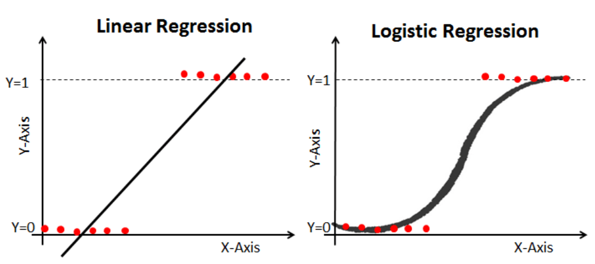

# Lineare Regression vs. Logistische Regression

- **Lineare Regression** liefert *kontinuierliche* Ausgaben, z. B. den Hauspreis.  
- **Logistische Regression** liefert *diskrete*, *binäre* (meist binäre) Ausgaben, z. B. „krank / nicht krank“ oder „Kunde kündigt / kündigt nicht“.

- Die **logistische Regression** wird mit der *Maximum-Likelihood-Methode (MLE)* geschätzt.  
- Die **lineare Regression** wird meist mit der *Methode der kleinsten Quadrate (OLS)* geschätzt; diese ist ein Spezialfall von MLE, wenn die Fehler normalverteilt sind.

Quelle: [datacamp.com](https://www.datacamp.com/tutorial/understanding-logistic-regression-python)
