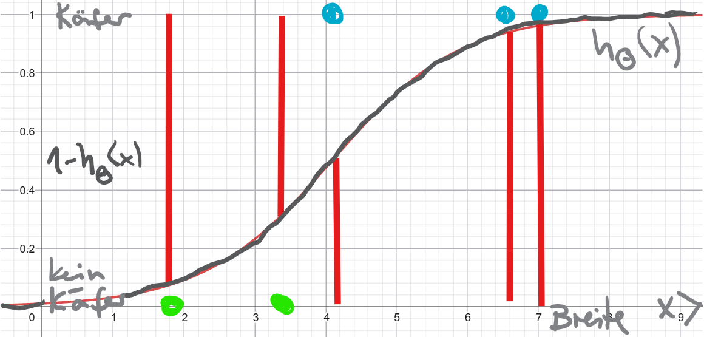

# Classification and logistic regression
Klassifikation ist fast wie lineare Regression, ausser dass der y-Wert nur einige wenige diskrete Werte annehmen kann. Wir betrachten im Folgenden die binäre Klassifikation, mit $y \in \{0,1\}$, wie bereits beim Naive Bayes Classifier mit Spam oder No-Spam Emails. Die Betrachtungen gelten weitgehend auch für Klassifikation mit mehreren Klassen. 

- **Lineare Regression** liefert *kontinuierliche* Ausgaben, zum Beispiel den Hauspreis.  
- **Logistische Regression** liefert *diskrete*, (meist) *binäre* Ausgaben wie „krank / nicht krank“ oder „Kunde kündigt / kündigt nicht“.

Quelle: [datacamp.com](https://www.datacamp.com/tutorial/understanding-logistic-regression-python)

## Logistic regression Modell

Wir könnten lineare Regression anwenden und ignorieren, dass $y$ diskret ist. Es ist jedoch einfach, Beispiele zu konstruieren, wo diese Methode sehr schlechte Resultate liefert. Und wir wollen auch vermeiden, dass $y$ grösser 1 oder kleiner 0 wird, da wir ja wissen dass $y \in \{0,1\}$.

Wir nehmen also als Hypothese nicht $\theta^T x$, wie bei der linearen Regression, sondern:

$$
h_{\theta}(x) = g(\theta^Tx) = \frac{1}{1+e^{-\theta^Tx}}
$$

wobei 

$$
g(z) = = \frac{1}{1+e^{-z}}
$$

die Sigmoidfunktion ist, auch als *logistic function* bezeichnet. 

Beachte, dass $g(z)$ nur Werte zwischen 0 und 1 liefert und für grosse $z$ gegen 1 wächst und für $z \rightarrow -\infty$ gegen 0. Wir behalten auch die Konvention $x_0 = 1$ so dass 

$$
\theta^Tx = \theta_0 + \theta_1x_1 + \ldots \theta_nx_n
$$

## Finden der Gewichte des Modells

Bei der linearen Regression haben wir die Fehlerfunktion $J(\theta)$ minimiert. Bei der logistischen Regression tun wir das mit einem probabilistischen Ansatz. Dabei gibt uns die Hypothese mit der Sigmoidfunktion die Wahrscheinlichkeit zurück, mit welcher ein Datenpunkt zur Klasse 0 oder 1 gehört. 

Wir nehmen folgendes an:

$$
P(y=1 | x,\theta) = h_{\theta}(x) 
$$

Anders ausgedrückt, sagen wir damit, dass die Wahrscheinlichkeit, dass ein Datenpunkt bestehend aus den Features $x_1, \ldots, x_n$ und irgend welchen Modellparametern $\theta_0, \ldots, \theta_n$ zur Klasse 1 gehört, genau $g(\theta^Tx)$ beträgt. Für die Klasse 0 ist die Wahrscheinlichkeit:

$$
P(y=0 | x,\theta) = 1-h_{\theta}(x)
$$

Mit einem Trick, welcher ausnutzt, dass $y \in \{0,1\}$, können wir diese Annahme wie folgt schreiben:

$$
P(y | x,\theta) = (h_{\theta}(x))^y\;(1-h_{\theta}(x))^{1-y}
$$

Wir wollen nun die Gewichte so finden, dass unsere Hypothese die maximale Wahrscheinlichkeit über alle Datenpunkte

$$
P(\vec{y} | X, \theta)
$$

maximal wird. Dann haben wir das beste Modell gefunden für unsere Trainingsdaten. Mit der Annahme, dass die $m$ Datenpunkte unabhängig generiert wurden, können wir die Wahrscheinlichkeiten der einzelnen Datenpunkte multiplizieren:

$$
P(\vec{y} | X, \theta) = P(y_1 | x_{1.}, \theta) P(y_2| x_{2.}, \theta) \ldots P(y_n|x_{n.}, \theta)
$$

### Machen wir ein Beispiel, um die Idee besser zu verstehen.

Klasse 1 = ist ein Käfer, Klasse 0 = ist kein Käfer. 

| # | Länge |Breite | Klasse |
| --- | --- | --- | --- |
| 1. | 20mm | 23mm | Käfer |
| 2. | 50mm | 22mm | kein Käfer |
| 3. | 15mm | 10mm | Käfer |
| 4. | 87mm | 39mm | Käfer |
| 5. | 95mm | 15mm | kein Käfer |

$$\vec{y}=
\begin{pmatrix}
1 \\
0 \\
1 \\
1 \\
0
\end{pmatrix} 
\text{,} \; X=
\begin{pmatrix}
1 & 20 & 23  \\
1 & 50 & 22 \\
1 & 15 & 10 \\
1 & 87 & 39 \\
1 & 95 & 15 
\end{pmatrix}
\text{und} \; \theta =
\begin{pmatrix}
\theta_0 \\
\theta_1 \\
\theta_2
\end{pmatrix}
\text{gesucht}
$$

Für $\theta^T = (1 \; 1 \; 1 )$ erhalten wir 

$$P(\vec{y} | X, \theta) = g(1+20+23)\cdot (1-g(1+50+22))\cdot g(1+15+10)\cdot g(1+87+39)\cdot (1-g(1+95+15))
$$.

Im Fall von nur einem Feature entspricht das dem Produkt der Längen der roten Linien im nachfolgenden Bild. Man kann sich gut vorstellen, dass hier die Gewichte noch nicht optimal gewählt sind. 

Die Aufgabe besteht nun darin, diese Wahrscheinlichkeit zu maximieren und die zugehörigen Gewichte zu finden. Dazu gibt es keine geschlossene Formel wie die Normalengleichung bei der linearen Regression. Die besten Gewichte werden mit dem *Gradientenverfahren* ermittelt. Der Gradient kann mit etwas Differenzialrechnung ermittelt werden, was uns hier nicht weiter beschäftigt. Nichts desto trotz merke man sich folgenden Trick, welcher oft eine wichtige Rolle spielt.

> Weil der Logarithmus streng monoton setigt, kann anstelle $P(\vec{y} | X, \theta)$ zu maximieren, auch $log (P(\vec{y} | X, \theta))$ maximiert werden. Letzteres wird auch *log likelihood* genannt. Das Produkt wird dann zu einer Summe und ist viel einfacher zu verarbeiten.

