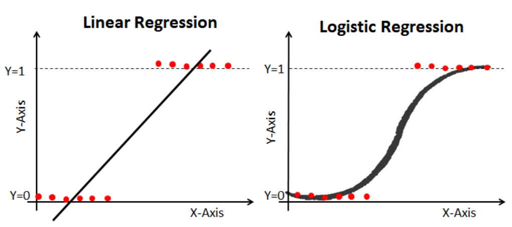

# Classification and logistic regression
Klassifikation ist fast wie lineare Regression, ausser dass der y-Wert nur einige wenige diskrete Werte annehmen kann. Wir betrachten im Folgenden die binäre Klassifikation, mit $y \in \{0,1\}$, wie bereits beim Naive Bayes Classifier mit Spam oder No-Spam Emails. Die Betrachtungen gelten weitgehend auch für Klassifikation mit mehreren Klassen. 

- **Lineare Regression** liefert *kontinuierliche* Ausgaben, zum Beispiel den Hauspreis.  
- **Logistische Regression** liefert *diskrete*, (meist) *binäre* Ausgaben wie „krank / nicht krank“ oder „Kunde kündigt / kündigt nicht“.

Quelle: [datacamp.com](https://www.datacamp.com/tutorial/understanding-logistic-regression-python)

## Logistic regression Modell

Wir könnten lineare Regression anwenden und ignorieren, dass $y$ diskret ist. Es ist jedoch einfach, Beispiele zu konstruieren, wo diese Methode sehr schlechte Resultate liefert. Und wir wollen auch vermeiden, dass $y$ grösser 1 oder kleiner 0 wird, da wir ja wissen dass $y \in \{0,1\}$.

Wir nehmen also als Hypothese nicht $\theta^T x$, wie bei der linearen Regression, sondern:

$$
h_{\theta}(x) = g(\theta^Tx) = \frac{1}{1+e^{-\theta^Tx}}
$$

wobei 

$$
g(z) = = \frac{1}{1+e^{-z}}
$$

die Sigmoidfunktion ist, auch als *logistic function* bezeichnet. 

Beachte, dass $g(z)$ nur Werte zwischen 0 und 1 liefert und für grosse $z$ gegen 1 wächst und für $z \rightarrow -\infty$ gegen 0. Wir behalten auch die Konvention $x_0 = 1$ so dass 

$$
\theta^Tx = \theta_0 + \theta_1x_1 + \ldots \theta_nx_n
$$

## Finden der Gewichte des Modells

Bei der linearen Regression haben wir die Fehlerfunktion $J(\theta)$ minimiert. Bei der logistischen Regression tun wir das mit einem probabilistischen Ansatz. Dabei gibt uns die Hypothese mit der Sigmoidfunktion die Wahrscheinlichkeit zurück, mit welcher ein Datenpunkt zur Klasse 0 oder 1 gehört. 

Wir nehmen folgendes an:

$$
P(y=1 | x,\theta) = h_{\theta}(x) 
$$

Anders ausgedrückt, sagen wir damit, dass die Wahrscheinlichkeit, dass ein Datenpunkt bestehend aus den Features $x_1, \ldots, x_n$ und irgend welchen Modellparametern $\theta_0, \ldots, \theta_n$ zur Klasse 1 gehört, genau $g(\theta^Tx)$ beträgt. Für die Klasse 0 ist die Wahrscheinlichkeit:

$$
P(y=0 | x,\theta) = 1-h_{\theta}(x)
$$

Mit einem Trick, welcher ausnutzt, dass $y \in \{0,1\}$, können wir diese Annahme wie folgt schreiben:

$$
P(y | x,\theta) = (h_{\theta}(x))^y\;(1-h_{\theta}(x))^{1-y}
$$