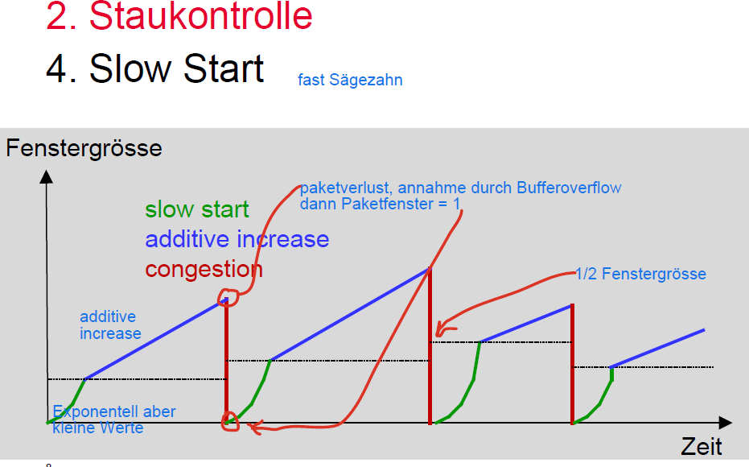

# 📡 Fluss- und Staukontrolle – Cheat Sheet (Kapitel 2)

## 1. Grundidee

### 🎯 Ziele
- **Flusskontrolle**: Empfänger vor Überlast schützen  
- **Staukontrolle**: Netzwerk (Router) vor Überlast schützen   

---

## 2. Flusskontrolle (TCP)

### 🔁 Grundprinzip
- basiert auf **Sliding Window**
- Empfänger steuert Datenrate

### 📦 Wichtige Felder

#### ✅ Acknowledgment Field (ACK)
- bestätigt alle Bytes **bis zu einer Sequenznummer**
- Sender weiss, was erfolgreich empfangen wurde   

#### ✅ Advertised Window
- wie viele Bytes der Empfänger noch aufnehmen kann
- wird im TCP-Header gesendet   

### 🧮 Regel

- Sender darf senden bis:
    - ACK + AdvertisedWindow

---

## 3. Staukontrolle (TCP)

### Motivation
TCP congestion control was introduced into the Internet in the late
1980s by Van Jacobson, roughly eight years after the TCP/IP protocol stack
had become operational. Immediately preceding this time, the Internet
was suffering from congestion collapse—hosts would send their packets
into the Internet as fast as the advertised window would allow, congestion
would occur at some router (causing packets to be dropped), and the
hosts would time out and retransmit their packets, resulting in even more
congestion. *ref:Peterson Kap 6*

### 🎯 Ziel
- Vermeidung von Überlast im Netzwerk (Router-Buffers)

### 📉 Problem
- Paketverluste → Wiederholungen → verstärken Stau   

---

### 3.1 Congestion Window (cwnd)
- steuert Sendefenster basierend auf Netzlast
- TCP maintains a new state variable for each connection, called CongestionWindow,
which is used by the source to limit how much data it
is allowed to have in transit at a given time.
- Um Stau im Netz festzustellen werden die auftretenden Timeouts, wenn ein Packet dropped wird, verwendet. 
- TCP interprets timeouts as a sign of congestion and reduces the rate at which it is transmitting 

---

### 3.2 Slow Start
The additive increase mechanism just is the right approach
to use when the source is operating close to the available capacity of
the network, but it takes too long to ramp up a connection when it is
starting from scratch. TCP therefore provides a second mechanism, ironically
called slow start,5 which is used to increase the congestion window
rapidly from a cold start. Slow start effectively increases the congestion
window exponentially, rather than linearly.

The source starts out by setting CongestionWindow to
one packet. When the ACK for this packet arrives, TCP adds 1 to CongestionWindow
and then sends two packets. Upon receiving the corresponding
two ACKs, TCP increments CongestionWindow by 2—one for each
ACK—and next sends four packets. The end result is that TCP effectively
doubles the number of packets it has in transit every RTT.

- Start mit:
    - cwnd = 1 MSS (Max Segment Size)

- Wachstum:
    - **exponentiell (Verdopplung pro RTT)**
    - bis Schwelle erreicht

- Slow Start is at the very beginning of a connection or it the connectin goes deas while waiting for a timeout. 

👉 gut für schnellen Verbindungsaufbau



---

### 3.3 Additive Increase (Congestion Avoidance)
cwnd erhöhen, wenn Stau im Netz runter, und cwnd verkleinern, wenn Stau zu nimmt im Netz.

- Every time the source successfully sends a CongestionWindow’s
worth of packets—that is, each packet sent out during the last round-trip
time (RTT) has been ACKed—it adds the equivalent of 1 packet to CongestionWindow.
- nach Slow Start:
- **lineares Wachstum**
    - +1 MSS pro RTT


- Ziel: stabile Nutzung

---

### 3.4 Verhalten bei Verlust

#### ⏱ Timeout
- starkes Zeichen von Stau
- Reaktion:
    - cwnd = 1 MSS

👉 konservativ → Netzwerk kann sich erholen   

#### 📉 Multiplicative Decrease
- cwnd wird halbiert, immer wenn ein Timeout passiert. 8-4-2-1. Min bei 1 MSS. 


👉 ergibt **Sägezahnverlauf**

One intuitive
reason to decrease the window aggressively and increase it conservatively
is that the consequences of having too large a window are much worse
than those of it being too small. For example, when the window is too
large, packets that are dropped will be retransmitted, making congestion
even worse; thus, it is important to get out of this state quickly.

---

### 3.5 Explicit Congestion Notification (ECN)

- Router markieren Pakete bei Stau (ToS-Bits)
- Sender reduziert Fenster **ohne Paketverlust**  
- Sender muss auch mitteilen, dass er ECN kann.  

---

## 4. Kombination Fluss + Staukontrolle

### 🧮 Wichtige Formeln

```
MaxWindow = min(cwnd, AdvertisedWindow)
EffectiveWindow = MaxWindow - (LastByteSent - LastByteAcked)

AdverteisedWindow = ReceiveBuffer -(lastByteSent - lastByteRead)
```

👉 Sender darf senden:

- EffectiveWindow Bytes


### ✅ Interpretation
- cwnd → Netzwerkgrenze (Routerbuffer, switches, links)  
- AdvertisesWindow → Grenze Empfängerbuffer  
- **Minimum bestimmt tatsächliches Limit**   

### Beispiel
- CongestinWindow = 24kB
- AdvertisingWindow = 16kB
- LastByteSent − LastByteAcked = 10KB

Der Sender empfängt 3 duplicate ACK, heisst Paketverlust.

**Welcher Mechanisumus limitiert den Sender?** Antwort: the AdvertisedWindow, is the smaller one. Thus the receiver buffer is the limit. 

**Wie viele Bytes kann der Sender noch senden?** Antwort: Der Sender kann bis *EffectiveWindwo senden, hat aber bereits 10KB im Netz, mit no ACK. Somit kann er noch 16-10=6KB senden. 

```
Gesendet
-------------------|
Bestätigt      EffectiveWin
------------|-------------|
                 noch erlaubt zum senden
                   |------|
```  
The Acknowledged Field gibt die bestätigten Bytes an (Seq No.). The receiver allows sending AckField + AckWindow. 

---

## 5. TCP-Varianten

### 🟢 Tahoe
- Basic Slow Start + Timeout

### 🔵 Reno
- Fast Retransmit (after 3 duplicated ACKs) + Fast Recovery  
- reagiert auf Paketverlust
- Halbiert nach 3 duplicated ACK das ConguestionWindow.

### 🟣 Vegas
- erkennt Stau über **RTT-Anstieg**
- reduziert Rate **vor Paketverlust**

👉 erkennt Stau früher als Reno   

---

## 6. Bandbreiten-Verzögerungs-Produkt (BDP)

### 📐 Definition

BDP = Bandbreite × RTT


### 🎯 Bedeutung
- wie viele Daten im Netz „in flight“ sein können

---

### ⚠️ Problem
- 32-bit Sequenznummern bei TCP können überlaufen
- bei hohen Bandbreiten sehr schnell (z.B. Sekunden)   

Beispiel: Bandbreite 1Gbit/s, dann 2^32Byte/(2^30 *8 Byte/s) = 32s

T1(1.5Mb/s) gibt SeqNo Überlauf nach 6.4h: 2^32/(1.5 *10^6 /8)s

Und das Bandbreitenverzögerungsprodukt beträgt bei T1 und 100ms 18.7kB (1.5Mb/s  * 0.1 = 1.5 * 10^6/8 * 0.1 = )

Und das original TCP Window Fiels ist 18bit=64kB. Wenn BDP grösser wird, wartet TCP dann fast dauernd auf ACKs. Un das zu verbessern brauchts andere Strategien. 

---

## 7. TCP-Optimierungen

### 📈 Window Scaling
- Advertised Window (16 Bit) → max 64 KB  
- Lösung: Skalierungsfaktor

### ⏱ RTT-Messung
- Timestamps für genauere RTT

### 🔐 Schutz vor Seq-Überlauf
- Kombination aus Timestamp + Sequenznummer

---

### 🚀 CUBIC

- speziell für hohe BDP-Netze

#### Eigenschaften
- Wachstum:

```
W(t) = C (t - K)^3 + Wmax
```

- unabhängig von RTT
- schnelles Zurück zu Wmax
- lange stabile Phase   

---

### 🧠 BBR
- basiert auf:
  - Bandbreite (Bottleneck)
  - RTT
- schätzt optimalen Betriebspunkt

---

## 8. Multi-Path TCP (MPTCP)

### 🎯 Ziel
- mehrere Netzwerkpfade gleichzeitig nutzen

### ✅ Vorteile
- höhere Robustheit
- bessere Auslastung
- z.B. WLAN + 5G gleichzeitig   

---

### 🔧 Struktur
- eine Verbindung (Connection)
- mehrere Subflows (TCP-Verbindungen)

---

### 🔢 Sequenznummern
- auf 2 Ebenen:
  - Subflow
  - Verbindung

---

### 📊 Kontrolle
- Flusskontrolle:
  - pro Subflow + global
- Staukontrolle:
  - pro Subflow
  - fair gegenüber normalem TCP

---

## ⚡ Prüfungs-Tipps

- ✅ Unterschied: **Flow vs Congestion Control**
- ✅ ACK + AdvertisedWindow erklären
- ✅ cwnd + Slow Start + AIMD verstehen
- ✅ Timeout → cwnd = 1 MSS (Begründung!)
- ✅ Formeln:
  - MaxWindow
  - EffectiveWindow
- ✅ Reno vs Vegas (Loss vs RTT)
- ✅ BDP Bedeutung erklären
- ✅ CUBIC vs Reno
- ✅ MPTCP → Vorteile + Aufbau

